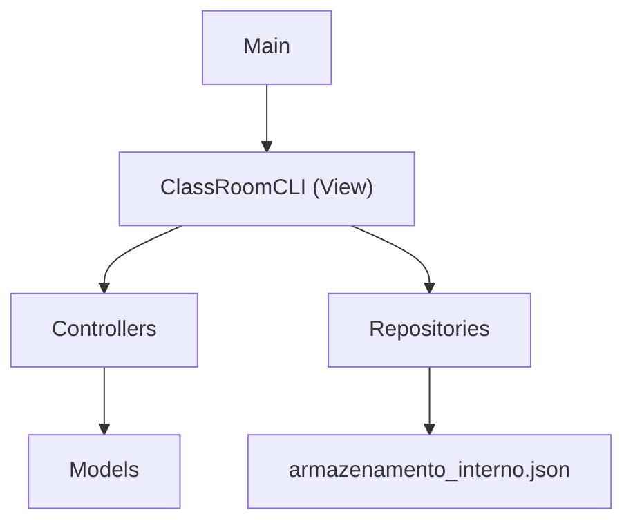

# Documentação do Projeto ClassRoomPB

## 1. Visão Geral

O **ClassRoomPB** é um sistema acadêmico simplificado desenvolvido em Java para a disciplina de Engenharia de Software II. O sistema utiliza uma interface de linha de comando (CLI), persistência local em arquivo JSON e organização baseada no padrão MVC.

O objetivo atual do projeto é atender ao núcleo inicial da Release 1, com foco em:

- Cadastro e autenticação de usuários.
- Controle de perfis de acesso.
- Cadastro de cursos.
- Cadastro de disciplinas.
- Cadastro, ativação e encerramento de períodos letivos.
- Persistência local dos dados.
- Testes automatizados com JUnit 5.

O projeto não utiliza API web, banco de dados externo ou interface gráfica. Toda interação acontece pelo terminal.

## 2. Tecnologias Utilizadas

- **Java 11** como versão de compilação definida no Maven.
- **Maven** para compilação, execução e gerenciamento de dependências.
- **JUnit 5.10.2** para testes automatizados.
- **JSON local** como mecanismo de persistência.
- **CLI** com `Scanner` para entrada de dados pelo terminal.

As configurações principais estão no arquivo `pom.xml`.

## 3. Estrutura de Pastas

```text
projeto_esw_ClassRoomPB/
+-- pom.xml
+-- README.md
+-- DOCUMENTACAO.md
+-- armazenamento_interno.json
+-- releases/
+-- src/
|   +-- main/
|   |   +-- java/
|   |       +-- pb/
|   |           +-- classroom/
|   |               +-- Main.java
|   |               +-- controller/
|   |               +-- model/
|   |               +-- repository/
|   |               +-- view/
|   +-- test/
|       +-- java/
|           +-- pb/
|               +-- classroom/
|                   +-- controller/
|                   +-- model/
+-- target/
```

## 4. Arquitetura MVC

O projeto segue uma divisão simples em camadas:



### Camada `model`

Contém as entidades e enumerações do domínio acadêmico. Exemplos:

- `Usuario`
- `Aluno`
- `Professor`
- `Coordenador`
- `Administrador`
- `Curso`
- `Disciplina`
- `PeriodoLetivo`
- `Turma`
- `BlocoHorario`
- `PerfilUsuario`

### Camada `controller`

Contém as regras de fluxo e validações de acesso. Os controllers não salvam diretamente em arquivo; eles manipulam listas em memória e retornam os objetos cadastrados.

Controllers atuais:

- `AutenticacaoController`
- `CursoController`
- `DisciplinaController`
- `PeriodoLetivoController`

### Camada `repository`

Responsável por carregar e salvar dados no arquivo `armazenamento_interno.json`.

Repositories atuais:

- `UsuarioRepository`
- `CursoRepository`
- `DisciplinaRepository`
- `PeriodoLetivoRepository`
- `ArmazenamentoJson`

### Camada `view`

Contém a interface de terminal:

- `ClassRoomCLI`

Essa classe exibe menus, lê dados do usuário, chama controllers e aciona repositories para salvar os dados.

## 5. Execução do Projeto

Para executar o projeto, entre na raiz:

```powershell
cd "C:\Users\rodri\Desktop\ESW2\projeto_esw_ClassRoomPB"
```

Depois rode:

```powershell
mvn compile exec:java
```

Classe principal:

```text
pb.classroom.Main
```

O `Main` apenas instancia a CLI e chama o método `iniciar()`.

## 6. Execução dos Testes

Na raiz do projeto:

```powershell
mvn test
```

Os testes estão em:

```text
src/test/java
```

Observação: é necessário ter o Maven instalado e disponível no `PATH` para executar os comandos `mvn`.

## 7. Usuários Iniciais e Persistência

O arquivo de persistência é:

```text
armazenamento_interno.json
```

Ele armazena:

- `usuarios`
- `disciplinas`
- `cursos`
- `periodosLetivos`

Caso o arquivo não exista ou não possua usuários, o sistema cria automaticamente um administrador inicial:

```text
Matrícula: 0001
E-mail: admin@classroompb.com
Senha: admin123
Perfil: ADMINISTRADOR
```

No estado atual do arquivo, também existem usuários de exemplo:

- Administrador: `admin@classroompb.com`
- Aluno: `lucas@classroompb.com`
- Coordenador: `coordenador@classroompb.com`

## 8. Perfis de Usuário

Os perfis são definidos no enum `PerfilUsuario`:

```java
ALUNO,
PROFESSOR,
COORDENADOR,
ADMINISTRADOR
```

Cada classe concreta de usuário sobrescreve `getPerfil()`:

- `Aluno` retorna `PerfilUsuario.ALUNO`.
- `Professor` retorna `PerfilUsuario.PROFESSOR`.
- `Coordenador` retorna `PerfilUsuario.COORDENADOR`.
- `Administrador` retorna `PerfilUsuario.ADMINISTRADOR`.

Essa lógica é importante para as regras de permissão do sistema.

## 9. Funcionalidades por Perfil

A classe `ClassRoomCLI` mostra opções diferentes conforme o perfil logado.

### Sem login

Opções exibidas:

- Login.
- Sair.

### Administrador

Pode:

- Trocar login.
- Ver dados do usuário logado.
- Fazer logout.
- Cadastrar usuário.
- Cadastrar curso.
- Listar cursos.

### Coordenador

Pode:

- Trocar login.
- Ver dados do usuário logado.
- Fazer logout.
- Cadastrar disciplina.
- Listar disciplinas.
- Listar cursos.
- Cadastrar período letivo.
- Listar períodos letivos.
- Ativar período letivo.
- Encerrar período letivo.

### Professor

Pode:

- Trocar login.
- Ver dados do usuário logado.
- Fazer logout.
- Listar disciplinas.
- Listar períodos letivos.

### Aluno

Pode:

- Trocar login.
- Ver dados do usuário logado.
- Fazer logout.
- Listar disciplinas.
- Listar períodos letivos.

## 10. Classes do Pacote `pb.classroom.model`

### `Usuario`

Classe abstrata base para todos os usuários autenticáveis.

Atributos:

- `id`
- `matricula`
- `email`
- `senha`
- `ativo`

Responsabilidades:

- Validar matrícula obrigatória.
- Validar e-mail obrigatório.
- Validar senha obrigatória.
- Armazenar estado ativo/inativo.
- Definir o contrato abstrato `getPerfil()`.
- Implementar igualdade por `id`.

### `Aluno`

Representa usuário com perfil de aluno.

Responsabilidade principal:

- Retornar `PerfilUsuario.ALUNO`.

### `Professor`

Representa usuário com perfil de professor.

Responsabilidade principal:

- Retornar `PerfilUsuario.PROFESSOR`.

### `Coordenador`

Representa usuário com perfil de coordenador.

Responsabilidade principal:

- Retornar `PerfilUsuario.COORDENADOR`.

### `Administrador`

Representa usuário com perfil de administrador.

Responsabilidade principal:

- Retornar `PerfilUsuario.ADMINISTRADOR`.

No fluxo atual, apenas administradores podem cadastrar usuários e cursos.

### `PerfilUsuario`

Enum que centraliza os papéis existentes no sistema:

- `ALUNO`
- `PROFESSOR`
- `COORDENADOR`
- `ADMINISTRADOR`

É usado pelos controllers e pela CLI para aplicar regras de acesso.

### `Curso`

Representa um curso cadastrado pelo administrador.

Atributos:

- `id`
- `nome`
- `codigo`

Regras:

- `id` não pode ser nulo ou vazio.
- `nome` é obrigatório.
- `codigo` é opcional.
- Igualdade é feita pelo `id`.

### `Disciplina`

Representa uma disciplina vinculada a um curso.

Atributos:

- `id`
- `codigo`
- `nome`
- `cargaHoraria`
- `creditos`
- `idCurso`
- `preRequisitosIds`

Regras:

- Código é obrigatório.
- Nome é obrigatório.
- Carga horária deve ser positiva.
- Créditos devem ser positivos.
- ID do curso é obrigatório.
- Pré-requisitos são opcionais.
- Uma disciplina não pode ser pré-requisito dela mesma.
- Não pode haver pré-requisito duplicado.
- A lista de pré-requisitos retornada é imutável.

### `PeriodoLetivo`

Representa um período letivo, como `2026.2`.

Atributos:

- `id`
- `codigo`
- `ativo`

Regras:

- `id` não pode ser nulo ou vazio.
- `codigo` é obrigatório.
- `codigo` deve seguir o formato `AAAA.N`, por exemplo `2026.2`.
- Um período novo inicia como encerrado/inativo.
- Pode ser ativado com `ativar()`.
- Pode ser encerrado com `encerrar()`.
- Igualdade é feita pelo `id`.

### `BlocoHorario`

Representa um intervalo de aula em um dia da semana.

Atributos:

- `diaSemana`
- `horaInicio`
- `horaFim`

Regras:

- Dia da semana é obrigatório.
- Hora de início é obrigatória.
- Hora de fim é obrigatória.
- Hora de fim deve ser depois da hora de início.
- Igualdade considera dia, início e fim.

Essa classe prepara a base para regras futuras de choque de horário.

### `Turma`

Representa uma turma ofertada para uma disciplina em um período letivo.

Atributos:

- `id`
- `idDisciplina`
- `idPeriodoLetivo`
- `idProfessor`
- `limiteVagas`
- `sala`
- `dataInicioAulas`
- `horarios`
- `cancelada`

Regras:

- ID da disciplina é obrigatório.
- ID do período letivo é obrigatório.
- ID do professor é obrigatório.
- Limite de vagas deve ser positivo.
- Sala é obrigatória.
- Data de início é obrigatória.
- A turma deve ter ao menos um bloco de horário.
- Igualdade é feita pelo `id`.

Observação: a classe `Turma` já existe como base de domínio, mas ainda não há controller, repository ou menu completo para oferta de turmas.

## 11. Classes do Pacote `pb.classroom.controller`

### `AutenticacaoController`

Controla login, logout, sessão atual e cadastro de usuários.

Principais métodos:

- `login(String identificador, String senha)`
- `cadastrarUsuario(PerfilUsuario perfil, String matricula, String email, String senha)`
- `logout()`
- `isAutenticado()`
- `getUsuarioLogado()`
- `getUsuarios()`

Regras:

- Login aceita matrícula ou e-mail.
- E-mail é comparado sem diferenciar maiúsculas/minúsculas.
- Senha precisa ser exatamente igual.
- Usuário inativo não consegue logar.
- Apenas administrador autenticado pode cadastrar usuários.
- Não permite matrícula duplicada.
- Não permite e-mail duplicado.
- `getUsuarios()` retorna lista imutável.

### `CursoController`

Controla o cadastro de cursos.

Principais métodos:

- `cadastrarCurso(String nome, String codigo)`
- `getCursos()`

Regras:

- Apenas administrador autenticado pode cadastrar curso.
- Nome do curso é obrigatório.
- Não permite curso duplicado por nome.
- Não permite código duplicado quando o código é informado.
- `getCursos()` retorna lista imutável.

### `DisciplinaController`

Controla o cadastro de disciplinas.

Principais métodos:

- `cadastrarDisciplina(String codigo, String nome, int cargaHoraria, int creditos, String idCurso, List<String> preRequisitosIds)`
- `getDisciplinas()`

Regras:

- Apenas coordenador autenticado pode cadastrar disciplina.
- Código da disciplina é obrigatório.
- Não permite disciplina duplicada por código.
- Pré-requisitos informados precisam existir na lista atual de disciplinas.
- `getDisciplinas()` retorna lista imutável.

Observação: no estado atual, o controller exige um `idCurso`, mas não valida se o curso existe no `CursoRepository`.

### `PeriodoLetivoController`

Controla cadastro e alteração de status dos períodos letivos.

Principais métodos:

- `cadastrarPeriodoLetivo(String codigo)`
- `ativarPeriodoLetivo(String id)`
- `encerrarPeriodoLetivo(String id)`
- `getPeriodosLetivos()`

Regras:

- Apenas coordenador autenticado pode gerenciar períodos letivos.
- Código é obrigatório.
- Código não pode ser duplicado.
- O formato do código é validado pelo model `PeriodoLetivo`.
- Só é possível ativar ou encerrar período existente.
- `getPeriodosLetivos()` retorna lista imutável.

## 12. Classes do Pacote `pb.classroom.repository`

### `ArmazenamentoJson`

Classe utilitária interna para manipular arrays dentro do arquivo JSON.

Responsabilidades:

- Extrair arrays por nome de campo.
- Retornar `[]` quando um campo ainda não existe.
- Montar o documento completo de persistência com usuários, disciplinas, cursos e períodos letivos.
- Validar se os conteúdos salvos como arrays começam com `[` e terminam com `]`.

Observação técnica: a implementação usa manipulação manual de texto e expressões regulares. Funciona para a estrutura atual simples, mas não substitui uma biblioteca JSON completa.

### `UsuarioRepository`

Carrega e salva usuários.

Responsabilidades:

- Ler usuários de `armazenamento_interno.json`.
- Criar administrador inicial se não houver arquivo ou lista de usuários.
- Converter JSON em objetos `Aluno`, `Professor`, `Coordenador` e `Administrador`.
- Converter objetos `Usuario` em JSON.
- Preservar disciplinas, cursos e períodos letivos ao salvar usuários.

### `CursoRepository`

Carrega e salva cursos.

Responsabilidades:

- Ler o array `cursos`.
- Converter JSON em objetos `Curso`.
- Converter cursos em JSON.
- Preservar usuários, disciplinas e períodos letivos ao salvar cursos.

### `DisciplinaRepository`

Carrega e salva disciplinas.

Responsabilidades:

- Ler o array `disciplinas`.
- Converter JSON em objetos `Disciplina`.
- Converter disciplinas em JSON.
- Salvar pré-requisitos como lista de IDs.
- Preservar usuários, cursos e períodos letivos ao salvar disciplinas.

### `PeriodoLetivoRepository`

Carrega e salva períodos letivos.

Responsabilidades:

- Ler o array `periodosLetivos`.
- Converter JSON em objetos `PeriodoLetivo`.
- Converter períodos em JSON.
- Preservar usuários, disciplinas e cursos ao salvar períodos.

## 13. Classe `ClassRoomCLI`

`ClassRoomCLI` é a interface de linha de comando do sistema.

Responsabilidades:

- Inicializar repositories.
- Carregar dados salvos.
- Criar controllers.
- Exibir menu principal.
- Exibir funcionalidades conforme o perfil do usuário.
- Ler entradas pelo terminal.
- Tratar exceções de validação e exibir mensagens.
- Salvar dados após cadastros ou alterações.

Fluxos implementados:

- Login.
- Ver dados do usuário logado.
- Logout.
- Cadastro de usuário.
- Cadastro de disciplina.
- Listagem de disciplinas.
- Cadastro de curso.
- Listagem de cursos.
- Cadastro de período letivo.
- Listagem de períodos letivos.
- Ativação de período letivo.
- Encerramento de período letivo.

## 14. Menu da Aplicação

Opções existentes no código:

```text
1  - Login / Trocar login
2  - Ver dados do usuário logado
3  - Logout
4  - Cadastrar usuário
5  - Cadastrar disciplina
6  - Listar disciplinas
7  - Cadastrar curso
8  - Listar cursos
9  - Cadastrar período letivo
10 - Listar períodos letivos
11 - Ativar período letivo
12 - Encerrar período letivo
0  - Sair
```

Nem todas as opções aparecem para todos os perfis. A exibição é filtrada no método `exibirFuncionalidadesPorPerfil`.

Mesmo que o usuário digite uma opção escondida, os métodos também validam o perfil antes de executar a ação.

## 15. Fluxo de Cadastro de Usuário

1. Usuário precisa estar autenticado.
2. Usuário precisa ter perfil `ADMINISTRADOR`.
3. A CLI solicita o tipo de usuário:
   - Aluno
   - Professor
   - Coordenador
   - Administrador
4. A CLI solicita matrícula, e-mail e senha.
5. O `AutenticacaoController` valida:
   - Perfil obrigatório.
   - Matrícula obrigatória.
   - E-mail obrigatório.
   - Senha obrigatória.
   - Duplicidade de matrícula.
   - Duplicidade de e-mail.
6. O usuário é criado.
7. O `UsuarioRepository` salva a lista no JSON.

## 16. Fluxo de Login

1. A CLI solicita matrícula/e-mail e senha.
2. O `AutenticacaoController` procura usuário por matrícula ou e-mail.
3. Se encontrar e a senha estiver correta, salva o usuário como sessão atual.
4. Se o usuário estiver inativo, o login é negado.
5. Se os dados estiverem incorretos, uma exceção é lançada e a CLI mostra a mensagem.

## 17. Fluxo de Cadastro de Curso

1. Usuário precisa estar autenticado.
2. Usuário precisa ter perfil `ADMINISTRADOR`.
3. A CLI solicita nome e código opcional.
4. O `CursoController` valida:
   - Administrador autenticado.
   - Nome obrigatório.
   - Nome não duplicado.
   - Código não duplicado quando informado.
5. O curso é criado.
6. O `CursoRepository` salva os cursos no JSON.

## 18. Fluxo de Cadastro de Disciplina

1. Usuário precisa estar autenticado.
2. Usuário precisa ter perfil `COORDENADOR`.
3. A CLI exibe disciplinas existentes para possível uso como pré-requisito.
4. A CLI solicita:
   - Código.
   - Nome.
   - Carga horária.
   - Créditos.
   - ID do curso.
   - IDs dos pré-requisitos.
5. A CLI converte carga horária e créditos para inteiro.
6. O `DisciplinaController` valida:
   - Coordenador autenticado.
   - Código obrigatório.
   - Código não duplicado.
   - Pré-requisitos existentes.
7. O model `Disciplina` valida:
   - Nome obrigatório.
   - Carga horária positiva.
   - Créditos positivos.
   - ID de curso obrigatório.
   - Pré-requisitos sem duplicidade.
8. O `DisciplinaRepository` salva as disciplinas no JSON.

## 19. Fluxo de Cadastro e Status de Período Letivo

Cadastro:

1. Usuário precisa estar autenticado.
2. Usuário precisa ter perfil `COORDENADOR`.
3. A CLI solicita o código do período, por exemplo `2026.2`.
4. O `PeriodoLetivoController` valida:
   - Coordenador autenticado.
   - Código obrigatório.
   - Código não duplicado.
5. O model `PeriodoLetivo` valida o formato.
6. O período é criado como inativo/encerrado.
7. O `PeriodoLetivoRepository` salva a lista no JSON.

Ativação/encerramento:

1. Usuário precisa ter perfil `COORDENADOR`.
2. A CLI lista os períodos existentes.
3. A CLI solicita o ID do período.
4. O controller busca o período.
5. O status é alterado.
6. A lista é salva novamente no JSON.

## 20. Testes Automatizados

Os testes usam JUnit 5.

### `UsuarioAtribuicaoTest`

Verifica:

- `Aluno` possui perfil `ALUNO`.
- `Professor` possui perfil `PROFESSOR`.
- `Coordenador` possui perfil `COORDENADOR`.
- `Administrador` possui perfil `ADMINISTRADOR`.
- As classes concretas instanciam corretamente.

### `AutenticacaoControllerLoginTest`

Verifica:

- Login por matrícula.
- Login por e-mail.
- Login com e-mail em caixa diferente.
- Login com espaços ao redor do identificador.
- Estado autenticado após login.
- Usuário logado retornado corretamente.
- Perfil retornado no login.
- Campos obrigatórios.
- Credenciais inválidas.
- Usuário inativo.
- Logout.
- Lista nula no construtor.
- Lista vazia.
- Imutabilidade da lista de usuários.

### `AutenticacaoControllerCadastroTest`

Verifica:

- Administrador cadastra aluno.
- Cadastro remove espaços de matrícula e e-mail.
- Usuário cadastrado consegue fazer login.
- Administrador cadastra professor.
- Administrador cadastra coordenador.
- Administrador cadastra outro administrador.
- Usuário não autenticado não cadastra.
- Aluno autenticado não cadastra.
- Campos obrigatórios no cadastro.
- Duplicidade de matrícula.
- Duplicidade de e-mail.
- E-mail duplicado ignorando maiúsculas/minúsculas.

### `CursoControllerTest`

Verifica:

- Administrador autenticado cadastra curso.
- Usuário sem perfil administrador não cadastra curso.
- Código duplicado não é permitido.
- Lista retornada por `getCursos()` é imutável.

### `PeriodoLetivoControllerTest`

Verifica:

- Coordenador autenticado cadastra período letivo.
- Usuário sem perfil coordenador não cadastra período.
- Período pode ser ativado.
- Período pode ser encerrado.
- Período duplicado não é permitido.
- Formato inválido é rejeitado.

## 21. Requisitos Funcionais Atendidos Parcial ou Totalmente

Com base no PDF do projeto, o estado atual cobre:

### RF01 - Cadastro de alunos, professores, coordenadores e administradores

Implementado via `AutenticacaoController.cadastrarUsuario`, acessível pela CLI para administradores.

### RF02 - Login com matrícula/e-mail e senha

Implementado via `AutenticacaoController.login`.

### RF03 - Validação de perfis e funcionalidades diferentes

Implementado em duas camadas:

- CLI exibe opções conforme perfil.
- Controllers bloqueiam ações para perfis não autorizados.

### RF04 - Impedir cadastro duplicado por matrícula ou e-mail

Implementado em `AutenticacaoController`.

### RF05 - Administrador cadastra cursos

Implementado em `CursoController`, `CursoRepository` e CLI.

### RF06 - Coordenador cadastra disciplinas

Implementado em `DisciplinaController` e CLI.

### RF07 - Disciplina possui código, nome, carga horária, créditos e pré-requisitos opcionais

Implementado no model `Disciplina`.

### RF08 - Coordenador cadastra períodos letivos

Implementado em `PeriodoLetivoController`, `PeriodoLetivoRepository` e CLI.

### RF09 - Ativar ou encerrar período letivo

Implementado por `ativarPeriodoLetivo` e `encerrarPeriodoLetivo`.

### RF10 a RF14 - Oferta de turmas

Ainda não há fluxo completo. Existe apenas a classe de domínio `Turma` e a classe `BlocoHorario`, que servem como base para implementação futura.

## 22. Limitações Atuais

Alguns pontos ainda não estão implementados completamente:

- Não existe controller/repository/CLI para oferta de turmas.
- `DisciplinaController` recebe `idCurso`, mas ainda não valida se o curso existe.
- Não existe cadastro de professores associado a turmas.
- Não existe regra de choque de horário para professor.
- Não existe alteração ou cancelamento de turma pela CLI.
- Não existe matrícula de alunos em turmas.
- Não existe lista de espera.
- Não existe frequência.
- Não existe notas, média, recuperação ou situação final.
- Não existe histórico acadêmico.
- Não existe geração de relatórios.
- A persistência JSON é manual e simples, baseada em texto/regex.

## 23. Pontos de Atenção Técnica

### Persistência manual

Os repositories fazem parsing manual de JSON. Isso é suficiente para o formato atual, mas pode ficar frágil se o arquivo crescer ou se objetos ficarem mais complexos.

Como o enunciado limita o uso a Java, JUnit e padrões de projeto, a persistência manual foi mantida simples.

### Senhas em texto puro

As senhas são salvas diretamente no JSON. Para um sistema real, isso não seria adequado. Como o projeto é acadêmico e simplificado, o foco atual está nas regras funcionais.

### Validação dupla de permissão

A CLI esconde opções por perfil, mas os controllers também validam permissões. Isso é importante porque não basta esconder a opção na tela: a regra precisa estar protegida no fluxo de negócio.

### Estado em memória

Ao iniciar a CLI, os repositories carregam listas em memória. Depois de cada alteração, a CLI chama o repository correspondente para salvar no JSON.

## 24. Como Evoluir o Projeto

Próximos passos naturais para a Release 1:

1. Criar `TurmaController`.
2. Criar `TurmaRepository`.
3. Adicionar opções na CLI para ofertar, alterar e cancelar turmas.
4. Validar se disciplina, período letivo e professor existem antes de criar turma.
5. Validar que professor responsável possui perfil `PROFESSOR`.
6. Implementar regra de choque de horário para professor.
7. Criar testes para turma e blocos de horário.
8. Melhorar validação de disciplina para exigir curso existente.

Próximos passos para releases futuras:

1. Consulta de turmas por aluno.
2. Solicitação de matrícula.
3. Controle de vagas.
4. Lista de espera.
5. Frequência.
6. Notas.
7. Histórico.
8. Relatórios.

## 25. Comandos Úteis

Compilar:

```powershell
mvn compile
```

Executar:

```powershell
mvn compile exec:java
```

Rodar testes:

```powershell
mvn test
```

Limpar arquivos gerados:

```powershell
mvn clean
```

Gerar pacote:

```powershell
mvn package
```

## 26. Resumo Final

O ClassRoomPB está estruturado em MVC, possui domínio acadêmico inicial, autenticação, controle de perfis, persistência local e testes automatizados para os fluxos principais já implementados.

O sistema já atende boa parte do núcleo inicial da Release 1, especialmente cadastro/login, perfis, cursos, disciplinas e períodos letivos. A maior pendência da Release 1 é a implementação completa de turmas e suas validações associadas.
