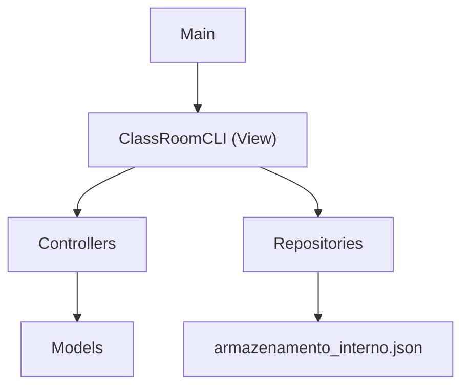

# Documentacao do Projeto ClassRoomPB

## 1. Visao Geral

O **ClassRoomPB** e um sistema academico simplificado desenvolvido em Java para a disciplina de Engenharia de Software II. O sistema usa interface de linha de comando (CLI), persistencia local em arquivo JSON e organizacao baseada no padrao MVC.

O projeto cobre atualmente:

- Cadastro e autenticacao de usuarios.
- Controle de perfis de acesso.
- Listagem de usuarios para administradores.
- Cadastro e listagem de cursos.
- Cadastro e listagem de disciplinas vinculadas a cursos existentes.
- Cadastro, ativacao e encerramento de periodos letivos.
- Oferta, alteracao e cancelamento de turmas.
- Matricula com confirmacao automatica, lista de espera e chamada automatica de alunos.
- Registro e consulta de presenca/falta e calculo de percentual de frequencia.
- Persistencia local dos dados.
- Testes automatizados com JUnit 5.
- Geracao automatica do relatorio `TESTE.md` ao rodar a suite de testes Maven.

O projeto nao utiliza API web, banco de dados externo ou interface grafica. Toda interacao acontece pelo terminal.

## 2. Tecnologias Utilizadas

- **Java 11** como versao de compilacao definida no Maven.
- **Maven** para compilacao, execucao, testes e gerenciamento de dependencias.
- **JUnit 5.10.2** para testes automatizados.
- **JSON local** como mecanismo de persistencia.
- **CLI** com `Scanner` para entrada de dados pelo terminal.
- **maven-surefire-plugin** para execucao e geracao dos XMLs de teste.
- **exec-maven-plugin** para gerar automaticamente o `TESTE.md` na fase `test`.

As configuracoes principais estao em `pom.xml`.

## 3. Estrutura de Pastas

```text
projeto_esw_ClassRoomPB/
+-- pom.xml
+-- README.md
+-- DOCUMENTACAO.md
+-- TESTE.md
+-- armazenamento_interno.json
+-- releases/
+-- src/
|   +-- main/
|   |   +-- java/
|   |       +-- pb/
|   |           +-- classroom/
|   |               +-- Main.java
|   |               +-- controller/
|   |               +-- model/
|   |               +-- repository/
|   |               +-- view/
|   +-- test/
|       +-- java/
|           +-- pb/
|               +-- classroom/
|                   +-- controller/
|                   +-- model/
|                   +-- report/
+-- target/
```

## 4. Arquitetura MVC

O projeto segue uma divisao simples em camadas:



### Camada `model`

Contem as entidades e enumeracoes do dominio academico:

- `Usuario`
- `PerfilUsuario`
- `Curso`
- `Disciplina`
- `PeriodoLetivo`
- `Turma`
- `BlocoHorario`

Observacao importante: as classes `Aluno`, `Professor`, `Coordenador` e `Administrador` foram removidas. Agora existe apenas `Usuario`, que armazena diretamente seu `PerfilUsuario`.

### Camada `controller`

Contem as regras de fluxo e validacoes de acesso. Os controllers manipulam listas em memoria e retornam os objetos cadastrados; a persistencia e acionada pela CLI.

Controllers atuais:

- `AutenticacaoController`
- `CursoController`
- `DisciplinaController`
- `PeriodoLetivoController`
- `TurmaController`
- `MatriculaController`
- `PresencaController`

### Camada `repository`

Responsavel por carregar e salvar dados em `armazenamento_interno.json`.

Repositories atuais:

- `UsuarioRepository`
- `CursoRepository`
- `DisciplinaRepository`
- `PeriodoLetivoRepository`
- `TurmaRepository`
- `MatriculaRepository`
- `PresencaRepository`
- `ArmazenamentoJson`

### Camada `view`

Contem a interface de terminal:

- `ClassRoomCLI`

Essa classe exibe menus, le dados do usuario, chama controllers e aciona repositories para salvar os dados.

## 5. Execucao do Projeto

Na raiz do projeto:

```powershell
cd "C:\Users\rodri\Desktop\ESW2\projeto_esw_ClassRoomPB"
mvn compile exec:java
```

Classe principal:

```text
pb.classroom.Main
```

O `Main` instancia a CLI e chama o metodo `iniciar()`.

## 6. Execucao dos Testes e Relatorio TESTE

Para rodar todos os testes:

```powershell
mvn test
```

Ou, para limpar os arquivos gerados antes de testar:

```powershell
mvn clean test
```

Ao rodar `mvn test` ou `mvn clean test`, o Maven:

1. Executa os testes com o `maven-surefire-plugin`.
2. Gera arquivos XML em `target/surefire-reports`.
3. Executa a classe `pb.classroom.report.TesteMarkdownReport`.
4. Le os XMLs `TEST-*.xml`.
5. Reescreve automaticamente o arquivo `TESTE.md` com o resumo atualizado.

O `TESTE.md` mostra:

- Data e hora da geracao.
- Status geral do build.
- Total de testes.
- Falhas, erros e testes ignorados.
- Resultado por suite de teste.

## 7. Usuarios Iniciais e Persistencia

O arquivo de persistencia e:

```text
armazenamento_interno.json
```

Ele armazena:

- `usuarios`
- `disciplinas`
- `cursos`
- `periodosLetivos`
- `turmas`
- `matriculas`
- `presencas`

Caso o arquivo nao exista ou nao possua usuarios, o sistema cria automaticamente um administrador inicial:

```text
Nome: Administrador Padrao
Matricula: 0001
E-mail: admin@classroompb.com
Senha: admin123
Perfil: ADMINISTRADOR
```

## 8. Perfis de Usuario

Os perfis sao definidos no enum `PerfilUsuario`:

```java
ALUNO,
PROFESSOR,
COORDENADOR,
ADMINISTRADOR
```

O perfil nao depende mais de heranca. Cada objeto `Usuario` possui um campo `perfil`, que e usado pelos controllers e pela CLI para aplicar regras de acesso.

## 9. Funcionalidades por Perfil

A classe `ClassRoomCLI` mostra opcoes diferentes conforme o perfil logado.

### Sem login

- Login.
- Sair.

### Administrador

- Trocar login.
- Ver dados do usuario logado.
- Logout.
- Cadastrar usuario.
- Cadastrar curso.
- Listar cursos.
- Listar usuarios.

### Coordenador

- Trocar login.
- Ver dados do usuario logado.
- Logout.
- Cadastrar disciplina.
- Listar disciplinas.
- Listar cursos.
- Listar turmas.
- Cadastrar periodo letivo.
- Listar periodos letivos.
- Ativar periodo letivo.
- Encerrar periodo letivo.
- Ofertar turma.
- Alterar turma.
- Cancelar turma.
- Consultar lista de espera.
- Remover aluno da lista de espera.
- Chamar proximos alunos da lista de espera.
- Consultar presencas por turma.
- Consultar percentual de frequencia.

### Professor

- Trocar login.
- Ver dados do usuario logado.
- Logout.
- Listar disciplinas.
- Listar turmas.
- Listar periodos letivos.
- Consultar lista de espera.
- Registrar presenca/falta.
- Consultar presencas por turma.
- Consultar percentual de frequencia.

### Aluno

- Trocar login.
- Ver dados do usuario logado.
- Logout.
- Listar disciplinas.
- Listar turmas disponiveis.
- Solicitar matricula.
- Cancelar matricula.
- Listar periodos letivos.
- Consultar posicao na lista de espera.
- Consultar minhas presencas.
- Consultar meu percentual de frequencia.

## 10. Classes do Pacote `pb.classroom.model`

### `Usuario`

Classe concreta para todos os usuarios autenticaveis.

Atributos:

- `id`
- `perfil`
- `nome`
- `matricula`
- `email`
- `senha`
- `ativo`

Responsabilidades:

- Validar perfil obrigatorio.
- Validar nome obrigatorio.
- Validar matricula obrigatoria.
- Validar e-mail obrigatorio.
- Validar senha obrigatoria.
- Armazenar estado ativo/inativo.
- Implementar igualdade por `id`.

### `PerfilUsuario`

Enum que centraliza os papeis existentes no sistema:

- `ALUNO`
- `PROFESSOR`
- `COORDENADOR`
- `ADMINISTRADOR`

### `Curso`

Representa um curso cadastrado pelo administrador.

Atributos:

- `id`
- `nome`
- `codigo`

Regras:

- `id` nao pode ser nulo ou vazio.
- `nome` e obrigatorio.
- `codigo` e opcional.
- Igualdade e feita pelo `id`.

### `Disciplina`

Representa uma disciplina vinculada a um curso.

Atributos:

- `id`
- `codigo`
- `nome`
- `cargaHoraria`
- `creditos`
- `idCurso`
- `preRequisitosIds`

Regras:

- Codigo e obrigatorio.
- Nome e obrigatorio.
- Carga horaria deve ser positiva.
- Creditos devem ser positivos.
- ID do curso e obrigatorio.
- O curso informado deve existir na lista de cursos conhecida pelo `DisciplinaController`.
- Pre-requisitos sao opcionais.
- Pre-requisitos informados precisam existir.
- Uma disciplina nao pode ser pre-requisito dela mesma.
- Nao pode haver pre-requisito duplicado.
- A lista de pre-requisitos retornada e imutavel.

### `PeriodoLetivo`

Representa um periodo letivo, como `2026.2`.

Atributos:

- `id`
- `codigo`
- `ativo`

Regras:

- `id` nao pode ser nulo ou vazio.
- `codigo` e obrigatorio.
- `codigo` deve seguir o formato `AAAA.N`, por exemplo `2026.2`.
- Um periodo novo inicia como encerrado/inativo.
- Pode ser ativado com `ativar()`.
- Pode ser encerrado com `encerrar()`.
- Igualdade e feita pelo `id`.

### `BlocoHorario`

Representa um intervalo de aula em um dia da semana.

Atributos:

- `diaSemana`
- `horaInicio`
- `horaFim`

Regras:

- Dia da semana e obrigatorio.
- Hora de inicio e obrigatoria.
- Hora de fim e obrigatoria.
- Hora de fim deve ser depois da hora de inicio.
- Igualdade considera dia, inicio e fim.

### `Turma`

Representa uma turma ofertada para uma disciplina em um periodo letivo.

Atributos:

- `id`
- `idDisciplina`
- `idPeriodoLetivo`
- `idProfessor`
- `limiteVagas`
- `sala`
- `dataInicioAulas`
- `horarios`
- `cancelada`

Essa classe e usada pelo fluxo de oferta de turmas (`RF10` a `RF14`).

### `Matricula`

Representa o vinculo persistido entre um aluno e uma turma.

Atributos:

- `id`
- `idAluno`
- `idTurma`
- `status` (`CONFIRMADA` ou `EM_ESPERA`)

Os campos sao obrigatorios e a igualdade e feita pelo `id`.

### `StatusMatricula`

Enum com os estados da matricula:

- `CONFIRMADA`
- `EM_ESPERA`

### `RegistroPresenca`

Registro individual de presenca ou falta de um aluno em uma turma em determinada data (RF27).

Atributos:

- `id`
- `idTurma`
- `idAluno`
- `data`
- `status` (`PRESENTE` ou `FALTA`)

### `StatusPresenca`

Enum com os estados do registro de presenca:

- `PRESENTE`
- `FALTA`

### `FrequenciaAluno`

Representa o percentual de frequencia calculado de um aluno em uma turma (RF28).

Atributos calculados:

- `idAluno`
- `idTurma`
- `totalAulasRegistradas`
- `totalPresencas`
- `percentual` (presencas / total de registros × 100)

## 11. Classes do Pacote `pb.classroom.controller`

### `AutenticacaoController`

Controla login, logout, sessao atual e cadastro de usuarios.

Principais metodos:

- `login(String identificador, String senha)`
- `cadastrarUsuario(PerfilUsuario perfil, String matricula, String nome, String senha)`
- `logout()`
- `isAutenticado()`
- `getUsuarioLogado()`
- `getUsuarios()`

Regras:

- Login aceita matricula ou e-mail.
- E-mail e comparado sem diferenciar maiusculas/minusculas.
- Senha precisa ser exatamente igual.
- Usuario inativo nao consegue logar.
- Apenas administrador autenticado pode cadastrar usuarios.
- Cadastro exige perfil, matricula, nome e senha.
- O e-mail e gerado automaticamente a partir do nome e perfil.
- Nao permite matricula duplicada.
- Nao permite e-mail gerado duplicado.
- `getUsuarios()` retorna lista imutavel.

Regra de e-mail automatico:

```text
Nome: Rodrigo Almeida Gomes
Perfil: ALUNO
E-mail: rodrigo.gomes@aluno.classroom.com

Nome: Rodrigo Almeida Gomes
Perfil: ADMINISTRADOR
E-mail: rodrigo.gomes@admin.classroom.com
```

Dominios por perfil:

- `ALUNO`: `@aluno.classroom.com`
- `PROFESSOR`: `@professor.classroom.com`
- `COORDENADOR`: `@coordenador.classroom.com`
- `ADMINISTRADOR`: `@admin.classroom.com`

### `CursoController`

Controla o cadastro de cursos.

Principais metodos:

- `cadastrarCurso(String nome, String codigo)`
- `getCursos()`

Regras:

- Apenas administrador autenticado pode cadastrar curso.
- Nome do curso e obrigatorio.
- Nao permite curso duplicado por nome.
- Nao permite codigo duplicado quando o codigo e informado.
- `getCursos()` retorna lista imutavel.

### `DisciplinaController`

Controla o cadastro de disciplinas.

Principais metodos:

- `cadastrarDisciplina(String codigo, String nome, int cargaHoraria, int creditos, String idCurso, List<String> preRequisitosIds)`
- `getDisciplinas()`

Regras:

- Apenas coordenador autenticado pode cadastrar disciplina.
- Codigo da disciplina e obrigatorio.
- Nao permite disciplina duplicada por codigo.
- O `idCurso` e obrigatorio.
- O curso informado precisa existir.
- Cursos cadastrados durante a mesma execucao sao reconhecidos pelo controller.
- Pre-requisitos informados precisam existir na lista atual de disciplinas.
- `getDisciplinas()` retorna lista imutavel.

### `PeriodoLetivoController`

Controla cadastro e alteracao de status dos periodos letivos.

Principais metodos:

- `cadastrarPeriodoLetivo(String codigo)`
- `ativarPeriodoLetivo(String id)`
- `encerrarPeriodoLetivo(String id)`
- `getPeriodosLetivos()`

Regras:

- Apenas coordenador autenticado pode gerenciar periodos letivos.
- Codigo e obrigatorio.
- Codigo nao pode ser duplicado.
- O formato do codigo e validado pelo model `PeriodoLetivo`.
- So e possivel ativar ou encerrar periodo existente.
- `getPeriodosLetivos()` retorna lista imutavel.

### `TurmaController`

Controla a oferta, alteracao e cancelamento de turmas.

Principais metodos:

- `ofertarTurma(String idDisciplina, String idPeriodoLetivo, String idProfessor, int limiteVagas, String sala, LocalDate dataInicioAulas, List<BlocoHorario> horarios)`
- `alterarTurma(String idTurma, String idProfessor, int limiteVagas, String sala, LocalDate dataInicioAulas, List<BlocoHorario> horarios)`
- `cancelarTurma(String idTurma)`
- `getTurmas()`

Regras:

- Apenas coordenador autenticado pode gerenciar turmas.
- A disciplina informada precisa existir.
- O periodo letivo informado precisa existir.
- O professor responsavel precisa existir e ter perfil `PROFESSOR`.
- A turma precisa ter limite de vagas positivo, sala e ao menos um horario.
- O sistema impede choque de horario para o mesmo professor.
- Turmas com professores diferentes podem ter o mesmo horario.
- Horarios que apenas encostam, como `08:00-10:00` e `10:00-12:00`, sao permitidos.
- Alteracao e cancelamento so sao permitidos antes da data de inicio das aulas.
- `getTurmas()` retorna lista imutavel.

### `MatriculaController`

Controla solicitacao, cancelamento, lista de espera e chamada automatica de alunos.

Principais metodos:

- `solicitarMatricula(String idTurma)`
- `cancelarMatricula(String idMatricula)`
- `consultarListaEspera(String idTurma)`
- `consultarListaEsperaOrdenadaPorSolicitacao(String idTurma)`
- `visualizarListaEsperaPorTurma(String idTurma)`
- `consultarPosicaoAluno(String idTurma)`
- `removerAlunoListaEspera(String idTurma, String idMatricula)`
- `consultarListaEsperaCompleta(String idTurma)`
- `processarChamadaAutomaticaListaEspera(String idTurma)`
- `chamarProximosAlunosListaEsperaManualmente(String idTurma)`

Regras:

- Apenas aluno autenticado pode solicitar ou cancelar a propria matricula.
- A turma precisa existir, nao estar cancelada e pertencer a periodo ativo.
- O aluno nao pode se matricular duas vezes na mesma turma.
- Os pre-requisitos da disciplina da turma devem estar atendidos.
- O sistema compara os blocos de horario das turmas do aluno no mesmo periodo letivo.
- Matricula confirmada quando ha vaga; caso contrario, status `EM_ESPERA`.
- Ao cancelar matricula confirmada ou aumentar vagas da turma, o sistema chama automaticamente o(s) proximo(s) aluno(s) elegivel(eis) da lista de espera (RF24).
- Alunos inelegiveis por choque de horario ou pre-requisitos sao pulados na promocao.
- Coordenador consulta, remove alunos da espera e pode acionar chamada manual.
- Professor da turma consulta a lista de espera completa.

### `PresencaController`

Controla registro e consulta de presenca/falta e calculo de frequencia (RF27, RF28).

Principais metodos:

- `registrarPresenca(String idTurma, LocalDate data, Map<String, Boolean> presencas)`
- `consultarPresencasPorTurma(String idTurma)`
- `consultarPresencasDoAluno(String idTurma)`
- `calcularFrequenciaAluno(String idTurma, String idAluno)`
- `consultarMinhaFrequencia(String idTurma)`
- `calcularFrequenciaPorTurma(String idTurma)`

Regras:

- Apenas o professor da turma registra presenca/falta.
- Apenas alunos com matricula confirmada podem ter presenca registrada.
- Nao permite registro duplicado para o mesmo aluno, turma e data.
- Data da presenca deve estar entre o inicio das aulas e a data atual.
- Coordenador ou professor da turma consultam presencas e frequencia de todos os alunos.
- Aluno consulta apenas suas proprias presencas e frequencia.
- Percentual de frequencia = presencas / total de registros × 100.

## 12. Classes do Pacote `pb.classroom.repository`

### `ArmazenamentoJson`

Classe utilitaria interna para manipular arrays dentro do arquivo JSON.

Responsabilidades:

- Extrair arrays por nome de campo.
- Retornar `[]` quando um campo ainda nao existe.
- Montar o documento completo de persistencia com usuarios, disciplinas, cursos, periodos letivos, turmas, matriculas e presencas.
- Validar se os conteudos salvos como arrays comecam com `[` e terminam com `]`.

Observacao tecnica: a implementacao usa manipulacao manual de texto e expressoes regulares. Funciona para a estrutura atual simples, mas nao substitui uma biblioteca JSON completa.

### `UsuarioRepository`

Carrega e salva usuarios.

Responsabilidades:

- Ler usuarios de `armazenamento_interno.json`.
- Criar administrador inicial se nao houver arquivo ou lista de usuarios.
- Converter JSON em objetos `Usuario`.
- Converter objetos `Usuario` em JSON.
- Preservar disciplinas, cursos, periodos letivos, turmas e matriculas ao salvar usuarios.

### `CursoRepository`

Carrega e salva cursos.

Responsabilidades:

- Ler o array `cursos`.
- Converter JSON em objetos `Curso`.
- Converter cursos em JSON.
- Preservar usuarios, disciplinas, periodos letivos, turmas e matriculas ao salvar cursos.

### `DisciplinaRepository`

Carrega e salva disciplinas.

Responsabilidades:

- Ler o array `disciplinas`.
- Converter JSON em objetos `Disciplina`.
- Converter disciplinas em JSON.
- Salvar pre-requisitos como lista de IDs.
- Preservar usuarios, cursos, periodos letivos, turmas e matriculas ao salvar disciplinas.

### `PeriodoLetivoRepository`

Carrega e salva periodos letivos.

Responsabilidades:

- Ler o array `periodosLetivos`.
- Converter JSON em objetos `PeriodoLetivo`.
- Converter periodos em JSON.
- Preservar usuarios, disciplinas, cursos, turmas e matriculas ao salvar periodos.

### `TurmaRepository`

Carrega e salva turmas.

Responsabilidades:

- Ler o array `turmas`.
- Converter JSON em objetos `Turma`.
- Converter turmas em JSON.
- Salvar horarios como strings no formato `DIA|HH:mm|HH:mm`.
- Preservar usuarios, disciplinas, cursos, periodos letivos e matriculas ao salvar turmas.

### `MatriculaRepository`

Carrega e salva matriculas.

Responsabilidades:

- Ler o array `matriculas`.
- Converter JSON em objetos `Matricula`.
- Converter matriculas em JSON, incluindo o campo `status`.
- Preservar usuarios, disciplinas, cursos, periodos letivos, turmas e presencas ao salvar matriculas.

### `PresencaRepository`

Carrega e salva registros de presenca.

Responsabilidades:

- Ler o array `presencas`.
- Converter JSON em objetos `RegistroPresenca`.
- Converter presencas em JSON.
- Preservar usuarios, disciplinas, cursos, periodos letivos, turmas e matriculas ao salvar presencas.

## 13. Classe `ClassRoomCLI`

`ClassRoomCLI` e a interface de linha de comando do sistema.

Responsabilidades:

- Inicializar repositories.
- Carregar dados salvos.
- Criar controllers.
- Exibir menu principal.
- Exibir funcionalidades conforme o perfil do usuario.
- Ler entradas pelo terminal.
- Tratar excecoes de validacao e exibir mensagens.
- Salvar dados apos cadastros ou alteracoes.

Fluxos implementados:

- Login.
- Ver dados do usuario logado.
- Logout.
- Cadastro de usuario.
- Listagem de usuarios.
- Cadastro de disciplina.
- Listagem de disciplinas.
- Cadastro de curso.
- Listagem de cursos.
- Cadastro de periodo letivo.
- Listagem de periodos letivos.
- Ativacao de periodo letivo.
- Encerramento de periodo letivo.
- Oferta de turma.
- Listagem de turmas.
- Alteracao de turma.
- Cancelamento de turma.
- Solicitacao de matricula com validacao de choque de horario.
- Cancelamento de matricula pelo aluno.
- Consulta e gestao da lista de espera.
- Chamada automatica de alunos da lista de espera.
- Registro e consulta de presenca/falta.
- Consulta de percentual de frequencia (por turma e por disciplina).
- Selecao numerada de registros e consultas consolidadas do aluno (ver secao de usabilidade em "14. Menu da Aplicacao").

## 14. Menu da Aplicacao

Opcoes existentes no codigo:

```text
1  - Login / Trocar login
2  - Ver dados do usuario logado
3  - Logout
4  - Cadastrar usuario
5  - Cadastrar disciplina
6  - Listar disciplinas
7  - Listar turmas
8  - Listar cursos / Solicitar matricula (aluno)
9  - Cadastrar periodo letivo
10 - Listar periodos letivos
11 - Ativar periodo letivo
12 - Encerrar periodo letivo
13 - Listar usuarios
14 - Ofertar turma
15 - Cancelar matricula (aluno)
16 - Alterar turma
17 - Cancelar turma
18 - Cadastrar curso
19 - Consultar lista de espera / posicao na espera (aluno)
20 - Remover da espera (coord.) / Registrar presenca (prof.) / Minhas presencas (aluno)
21 - Consultar presencas por turma
22 - Chamar proximos da espera (coord.) / Minha frequencia (aluno)
23 - Consultar percentual de frequencia (coord./prof.)
24 - Consultar minha frequencia por disciplina (aluno)
0  - Sair
```

Nem todas as opcoes aparecem para todos os perfis. A exibicao e filtrada no metodo `exibirFuncionalidadesPorPerfil`.

Mesmo que o usuario digite uma opcao escondida, os metodos tambem validam o perfil antes de executar a acao.

### Usabilidade: selecao por numero e consultas consolidadas

Para reduzir a digitacao de identificadores (UUIDs) das turmas, disciplinas, periodos e matriculas, a CLI adota dois padroes:

- **Selecao numerada hibrida:** nos fluxos que exigem escolher um registro (ofertar/alterar/cancelar turma, registrar/consultar presenca, lista de espera, ativar/encerrar periodo, cancelar matricula, etc.), a CLI exibe uma lista numerada com descricoes legiveis (por exemplo, `codigo - nome | Periodo | Sala | Horario`) e o usuario digita apenas o **numero** da opcao. Por compatibilidade e automacao, o **ID direto** continua sendo aceito no mesmo campo.
- **Listas filtradas pelo relacionamento do usuario:** o professor so ve as turmas que leciona e o aluno so ve as turmas em que possui matricula; o coordenador ve todas.
- **Consultas do aluno que listam tudo:** as opcoes do aluno de presencas (20), frequencia por turma (22), posicao na lista de espera (19) e frequencia por disciplina (24) percorrem automaticamente todos os registros relacionados ao aluno logado e os exibem de uma vez, sem pedir o codigo da turma/disciplina.
- **Separadores visuais:** listagens e blocos de dados de entrada/saida sao separados por uma linha tracejada para facilitar a leitura no terminal.

## 15. Fluxo de Cadastro de Usuario

1. Usuario precisa estar autenticado.
2. Usuario precisa ter perfil `ADMINISTRADOR`.
3. A CLI solicita o tipo de usuario:
   - Aluno
   - Professor
   - Coordenador
   - Administrador
4. A CLI solicita matricula, nome completo e senha.
5. O `AutenticacaoController` valida:
   - Perfil obrigatorio.
   - Matricula obrigatoria.
   - Nome obrigatorio.
   - Senha obrigatoria.
   - Duplicidade de matricula.
   - Duplicidade do e-mail gerado.
6. O e-mail e gerado automaticamente pelo primeiro e ultimo nome e pelo perfil.
7. O usuario e criado.
8. O `UsuarioRepository` salva a lista no JSON.

## 16. Fluxo de Login

1. A CLI solicita matricula/e-mail e senha.
2. O `AutenticacaoController` procura usuario por matricula ou e-mail.
3. Se encontrar e a senha estiver correta, salva o usuario como sessao atual.
4. Se o usuario estiver inativo, o login e negado.
5. Se os dados estiverem incorretos, uma excecao e lancada e a CLI mostra a mensagem.

## 17. Fluxo de Cadastro de Curso

1. Usuario precisa estar autenticado.
2. Usuario precisa ter perfil `ADMINISTRADOR`.
3. A CLI solicita nome e codigo opcional.
4. O `CursoController` valida:
   - Administrador autenticado.
   - Nome obrigatorio.
   - Nome nao duplicado.
   - Codigo nao duplicado quando informado.
5. O curso e criado.
6. O `CursoRepository` salva os cursos no JSON.

## 18. Fluxo de Cadastro de Disciplina

1. Usuario precisa estar autenticado.
2. Usuario precisa ter perfil `COORDENADOR`.
3. A CLI exibe uma lista numerada de cursos para que o coordenador escolha o curso da disciplina (aceita o numero ou o ID).
4. A CLI exibe disciplinas existentes para possivel uso como pre-requisito.
5. A CLI solicita:
   - Codigo.
   - Nome.
   - Carga horaria.
   - Creditos.
   - Curso (numero da lista ou ID).
   - IDs dos pre-requisitos.
6. A CLI converte carga horaria e creditos para inteiro.
7. O `DisciplinaController` valida:
   - Coordenador autenticado.
   - Codigo obrigatorio.
   - Codigo nao duplicado.
   - Curso existente.
   - Pre-requisitos existentes.
8. O model `Disciplina` valida:
   - Nome obrigatorio.
   - Carga horaria positiva.
   - Creditos positivos.
   - ID de curso obrigatorio.
   - Pre-requisitos sem duplicidade.
9. O `DisciplinaRepository` salva as disciplinas no JSON.

## 19. Fluxo de Cadastro e Status de Periodo Letivo

Cadastro:

1. Usuario precisa estar autenticado.
2. Usuario precisa ter perfil `COORDENADOR`.
3. A CLI solicita o codigo do periodo, por exemplo `2026.2`.
4. O `PeriodoLetivoController` valida:
   - Coordenador autenticado.
   - Codigo obrigatorio.
   - Codigo nao duplicado.
5. O model `PeriodoLetivo` valida o formato.
6. O periodo e criado como inativo/encerrado.
7. O `PeriodoLetivoRepository` salva a lista no JSON.

Ativacao/encerramento:

1. Usuario precisa ter perfil `COORDENADOR`.
2. A CLI lista os periodos existentes de forma numerada.
3. A CLI solicita a escolha do periodo (numero da lista ou ID).
4. O controller busca o periodo.
5. O status e alterado.
6. A lista e salva novamente no JSON.

## 20. Fluxo de Oferta, Alteracao e Cancelamento de Turmas

Oferta:

1. Usuario precisa estar autenticado.
2. Usuario precisa ter perfil `COORDENADOR`.
3. A CLI exibe disciplinas, periodos letivos e professores disponiveis em listas numeradas.
4. A CLI solicita:
   - Disciplina (numero da lista ou ID).
   - Periodo letivo (numero da lista ou ID).
   - Professor responsavel (numero da lista ou ID).
   - Limite de vagas.
   - Sala.
   - Data de inicio das aulas.
   - Um ou mais blocos de horario.
5. O `TurmaController` valida:
   - Coordenador autenticado.
   - Disciplina existente.
   - Periodo letivo existente.
   - Professor existente e com perfil `PROFESSOR`.
   - Ausencia de choque de horario para o professor.
6. O model `Turma` valida professor responsavel, limite de vagas, sala, data e horarios.
7. O `TurmaRepository` salva a lista no JSON.

Alteracao:

1. Usuario precisa ter perfil `COORDENADOR`.
2. A CLI lista as turmas existentes de forma numerada.
3. A CLI solicita a escolha da turma (numero da lista ou ID) e os novos dados.
4. O controller valida se a turma existe.
5. A alteracao so e permitida antes da data de inicio das aulas.
6. O controller revalida professor responsavel e choque de horario.
7. A lista e salva novamente no JSON.

Cancelamento:

1. Usuario precisa ter perfil `COORDENADOR`.
2. A CLI lista as turmas existentes de forma numerada.
3. A CLI solicita a escolha da turma (numero da lista ou ID).
4. O controller valida se a turma existe.
5. O cancelamento so e permitido antes da data de inicio das aulas.
6. A turma e marcada como cancelada e a lista e salva no JSON.

## 21. Testes Automatizados

Os testes usam JUnit 5 e ficam em `src/test/java`.

### `UsuarioAtribuicaoTest`

Verifica:

- `Usuario` guarda o perfil informado sem depender de subclasses.
- Perfil nulo e rejeitado.

### `AutenticacaoControllerLoginTest`

Verifica:

- Login por matricula.
- Login por e-mail sem diferenciar maiusculas/minusculas.
- Credenciais invalidas.
- Usuario inativo.
- Logout.
- Campos obrigatorios.
- Imutabilidade da lista de usuarios.

### `AutenticacaoControllerCadastroTest`

Verifica:

- Administrador cadastra usuario.
- E-mail e gerado automaticamente a partir do nome e perfil.
- Administrador usa dominio `admin.classroom.com`.
- Usuario nao administrador nao cadastra.
- Campos obrigatorios no cadastro.
- Duplicidade de matricula.
- Duplicidade de e-mail gerado.

### `CursoControllerTest`

Verifica:

- Administrador autenticado cadastra curso.
- Usuario sem perfil administrador nao cadastra curso.
- Nome duplicado nao e permitido.
- Codigo duplicado nao e permitido.
- Campos obrigatorios.
- Lista retornada por `getCursos()` e imutavel.

### `DisciplinaControllerTest`

Verifica:

- Coordenador cadastra disciplina para curso existente.
- Curso inexistente impede cadastro de disciplina.
- Usuario sem perfil coordenador nao cadastra disciplina.
- Curso adicionado apos criar o controller tambem e reconhecido.

### `PeriodoLetivoControllerTest`

Verifica:

- Coordenador autenticado cadastra periodo letivo.
- Usuario sem perfil coordenador nao cadastra periodo.
- Periodo pode ser ativado.
- Periodo pode ser encerrado.
- Periodo duplicado nao e permitido.
- Formato invalido e rejeitado.

### `MatriculaControllerTest`

Verifica:

- Bloqueio de choque de horario no mesmo dia e periodo letivo.
- Permissao para horarios consecutivos.
- Permissao para dias ou periodos diferentes.
- Turma cancelada ja matriculada nao gera conflito.
- Apenas aluno autenticado solicita matricula.
- Turma indisponivel, inexistente ou duplicada e rejeitada.

### `ConfirmarMatriculaAutomaticaTest`

Verifica (RF20):

- Matricula confirmada quando ha vagas disponiveis.
- Matricula rejeitada quando turma esta lotada.
- Matricula confirmada no limite exato de vagas.
- Segunda matricula rejeitada quando ultima vaga foi preenchida.
- Matricula confirmada quando disciplina nao possui pre-requisitos.
- Matricula confirmada quando pre-requisito atendido.
- Matricula rejeitada quando pre-requisito nao atendido.
- Matricula confirmada com multiplos pre-requisitos todos atendidos.
- Matricula rejeitada com multiplos pre-requisitos quando um nao atendido.

### `TurmaControllerTest`

Verifica:

- Coordenador oferta turma para disciplina e periodo existentes.
- Usuario sem perfil coordenador nao oferta turma.
- Disciplina ou periodo inexistente impedem oferta de turma.
- Turma exige professor, limite de vagas, sala e horario validos.
- Choque de horario para o mesmo professor e impedido.
- Professor diferente ou horario sem sobreposicao e permitido.
- Professor responsavel precisa existir e ter perfil `PROFESSOR`.
- Coordenador altera e cancela turma antes do inicio das aulas.
- Turma nao pode ser alterada ou cancelada apos o inicio das aulas.
- Turma inexistente nao pode ser alterada ou cancelada.

### `TurmaRepositoryTest`

Verifica:

- Turmas sao salvas e carregadas com horarios e status de cancelamento.
- Salvar turmas preserva os demais arrays do armazenamento.

### `MatriculaRepositoryTest`

Verifica:

- Salvamento e carregamento de matriculas.
- Preservacao das demais colecoes do armazenamento.
- Persistencia de status `EM_ESPERA` e ordem da lista de espera.

### `PresencaRepositoryTest`

Verifica salvamento, carregamento e preservacao das demais colecoes ao salvar presencas.

### `ListaEsperaRf23Test`, `ListaEsperaRf24Test`, `ListaEsperaRf25Rf26Test`

Verificam consulta, remocao, ordem FIFO, chamada automatica e visualizacao da lista de espera (RF23 a RF26).

### `PresencaRf27Test`, `PresencaRf28Test`

Verificam registro de presenca/falta, consultas por perfil e calculo de percentual de frequencia (RF27 e RF28).

### `FrequenciaAlunoTest`, `RegistroPresencaTest`

Verificam validacoes e calculos dos models de frequencia e presenca.

### `ClassRoomCLIFluxosIntegradosTest`

Verifica fluxos integrados da CLI, incluindo lista de espera, chamada automatica, frequencia e cadastro com pre-requisito.

Inclui tambem testes de usabilidade que cobrem os novos padroes de navegacao:

- Selecao de turma pelo **numero** da lista (alem do ID) na consulta de lista de espera do coordenador.
- Consulta do aluno que lista **todas** as suas presencas sem informar a turma (opcao 20).
- Consulta do aluno de frequencia por disciplina listando **todas** as disciplinas (opcao 24).
- Presenca de **separadores tracejados** entre itens nas listagens.

### `TesteMarkdownReport`

Classe auxiliar de teste/relatorio. Ela nao e uma suite JUnit; e executada pelo `exec-maven-plugin` na fase `test`.

Responsabilidades:

- Ler `target/surefire-reports/TEST-*.xml`.
- Somar testes, falhas, erros e ignorados.
- Gerar o arquivo `TESTE.md`.

## 22. Requisitos Funcionais Atendidos Parcial ou Totalmente

### RF01 - Cadastro de alunos, professores, coordenadores e administradores

Implementado via `AutenticacaoController.cadastrarUsuario`, acessivel pela CLI para administradores. Os tipos sao representados pelo campo `PerfilUsuario` em `Usuario`.

### RF02 - Login com matricula/e-mail e senha

Implementado via `AutenticacaoController.login`.

### RF03 - Validacao de perfis e funcionalidades diferentes

Implementado em duas camadas:

- CLI exibe opcoes conforme perfil.
- Controllers bloqueiam acoes para perfis nao autorizados.

### RF04 - Impedir cadastro duplicado por matricula ou e-mail

Implementado em `AutenticacaoController`. Como o e-mail agora e gerado automaticamente, a duplicidade e verificada sobre o e-mail gerado.

### RF05 - Administrador cadastra cursos

Implementado em `CursoController`, `CursoRepository` e CLI.

### RF06 - Coordenador cadastra disciplinas

Implementado em `DisciplinaController` e CLI.

### RF07 - Disciplina possui codigo, nome, carga horaria, creditos e pre-requisitos opcionais

Implementado no model `Disciplina`, com validacao adicional de curso existente no controller.

### RF08 - Coordenador cadastra periodos letivos

Implementado em `PeriodoLetivoController`, `PeriodoLetivoRepository` e CLI.

### RF09 - Ativar ou encerrar periodo letivo

Implementado por `ativarPeriodoLetivo` e `encerrarPeriodoLetivo`.

### RF10 - Coordenador oferta turmas

Implementado em `TurmaController`, `TurmaRepository` e CLI. A turma precisa estar associada a uma disciplina existente e a um periodo letivo existente.

### RF11 - Turma possui professor, vagas, horario e sala

Implementado no model `Turma` e no fluxo de oferta. A turma exige professor responsavel, limite de vagas positivo, sala e ao menos um `BlocoHorario`.

### RF12 - Impedir choque de horario para professor

Implementado em `TurmaController`. O sistema rejeita turmas sobrepostas para o mesmo professor no mesmo dia.

### RF13 - Impedir oferta sem professor responsavel

Implementado em `TurmaController` e `Turma`. O professor precisa ser informado, existir e possuir perfil `PROFESSOR`.

### RF14 - Alterar ou cancelar turma antes do inicio das aulas

Implementado em `TurmaController` e CLI. A alteracao e o cancelamento sao bloqueados quando a data atual nao e anterior a `dataInicioAulas`.

### RF15 - Aluno consulta disciplinas e turmas disponiveis

Implementado em `TurmaController` e CLI. Para o aluno, sao exibidas apenas turmas nao canceladas de periodos letivos ativos e as disciplinas vinculadas a essas turmas.

### RF19 - Impedir choque de horario entre turmas do mesmo aluno

Implementado em `MatriculaController`, `MatriculaRepository` e CLI. Uma nova matricula e rejeitada quando seus blocos de horario se sobrepoem aos de outra turma do aluno no mesmo periodo letivo.

### RF20 - Confirmar matricula automatica

Implementado em `MatriculaController`. Ao solicitar matricula, o sistema automaticamente valida:

- Vagas disponiveis na turma (total de matriculas confirmadas vs `limiteVagas`).
- Pre-requisitos da disciplina da turma (aluno deve possuir matricula em turma de cada disciplina pre-requisito).

Se todas as validacoes passarem (alem das validacoes ja existentes de turma disponivel, duplicidade e choque de horario), a matricula e confirmada automaticamente quando houver vaga. Caso nao haja vaga, a solicitacao e registrada com status `EM_ESPERA`.

### RF21 - Lista de espera

Implementado em `MatriculaController` e `MatriculaRepository`. Quando nao ha vaga, a matricula fica com status `EM_ESPERA`. Ao liberar vaga, o sistema promove automaticamente o proximo aluno elegivel da fila (ver RF24).

### RF22 - Cancelar matricula dentro do periodo permitido

Implementado em `MatriculaController` e CLI. O aluno autenticado pode cancelar a propria matricula antes da data de inicio das aulas da turma. Apos essa data, o cancelamento e bloqueado.

### RF23 - Manter lista de espera por turma

Implementado em `MatriculaController` e CLI. Coordenador e professor da turma consultam a lista de espera; aluno consulta sua posicao; coordenador remove aluno da espera.

### RF24 - Chamar automaticamente o proximo aluno da lista de espera

Implementado em `MatriculaController` e CLI. Ao cancelar matricula confirmada ou aumentar o limite de vagas da turma, o sistema promove automaticamente o(s) proximo(s) aluno(s) elegivel(eis) em ordem FIFO, pulando inelegiveis. Coordenador pode acionar manualmente pela opcao 22.

### RF25 - Ordem de solicitacao na lista de espera

Implementado em `MatriculaController`. A consulta da lista de espera respeita a ordem de chegada das solicitacoes.

### RF26 - Coordenador visualiza lista de espera

Implementado em `MatriculaController` e CLI. Apenas coordenador visualiza a lista de espera completa por turma via `visualizarListaEsperaPorTurma`.

### RF27 - Registrar presenca/falta dos alunos

Implementado em `PresencaController`, `PresencaRepository` e CLI. Professor da turma registra presenca ou falta; coordenador e professor consultam; aluno consulta os proprios registros.

### RF28 - Calcular percentual de frequencia

Implementado em `PresencaController` e model `FrequenciaAluno`. Calcula presencas / total de registros × 100 por aluno e turma. Coordenador, professor e aluno consultam conforme perfil.

## 23. Limitacoes Atuais

Alguns pontos ainda nao estao implementados completamente:

- Nao existe notas, media, recuperacao ou situacao final.
- Nao existe historico academico.
- A validacao de pre-requisitos considera "atendido" quando o aluno possui uma matricula em turma da disciplina pre-requisito, sem verificar aprovacao por nota (pois notas nao estao implementadas).
- A persistencia JSON e manual e simples, baseada em texto/regex.

## 24. Pontos de Atencao Tecnica

### Persistencia manual

Os repositories fazem parsing manual de JSON. Isso e suficiente para o formato atual, mas pode ficar fragil se o arquivo crescer ou se objetos ficarem mais complexos.

### Senhas em texto puro

As senhas sao salvas diretamente no JSON. Para um sistema real, isso nao seria adequado. Como o projeto e academico e simplificado, o foco atual esta nas regras funcionais.

### Validacao dupla de permissao

A CLI esconde opcoes por perfil, mas os controllers tambem validam permissoes. Isso e importante porque nao basta esconder a opcao na tela: a regra precisa estar protegida no fluxo de negocio.

### Estado em memoria

Ao iniciar a CLI, os repositories carregam listas em memoria. Depois de cada alteracao, a CLI chama o repository correspondente para salvar no JSON.

### Relatorio de testes versionado

O arquivo `TESTE.md` e reescrito sempre que `mvn test` ou `mvn clean test` termina com sucesso. Por isso, ele pode aparecer como modificado no Git apos uma nova execucao de testes, mesmo que o codigo nao tenha sido alterado.

## 25. Como Evoluir o Projeto

Proximos passos naturais:

1. Evoluir a interface para desktop ou web (a CLI ja adota selecao numerada, listas filtradas por usuario e separadores para melhor usabilidade).
2. Adicionar filtros de turma por disciplina, professor ou periodo letivo.
3. Ampliar testes de integracao de CLI para fluxos ainda nao cobertos.

Ja concluidos nesta iteracao de usabilidade:

- Exibicao de nomes de disciplina, periodo e horario nas listagens/selecoes de turmas, alem dos IDs.
- Selecao numerada (aceitando tambem o ID) em vez de digitar UUIDs.
- Consultas do aluno que listam automaticamente todos os registros relacionados.

Proximos passos para releases futuras:

1. Notas, media e recuperacao.
2. Historico academico.
3. Relatorios academicos.
4. Frequencia minima obrigatoria para aprovacao.

## 26. Comandos Uteis

Compilar:

```powershell
mvn compile
```

Executar:

```powershell
mvn compile exec:java
```

Rodar testes e atualizar `TESTE.md`:

```powershell
mvn test
```

Limpar e rodar todos os testes:

```powershell
mvn clean test
```

Limpar arquivos gerados:

```powershell
mvn clean
```

Gerar pacote:

```powershell
mvn package
```

## 27. Resumo Final

O ClassRoomPB esta estruturado em MVC, possui dominio academico completo ate a release atual, autenticacao, controle de perfis, persistencia local e testes automatizados para os fluxos principais implementados.

O estado atual cobre cadastro/login, perfis, usuarios, cursos, disciplinas, periodos letivos, turmas, matricula com lista de espera e chamada automatica, presenca/falta, percentual de frequencia e relatorio automatico de testes com cobertura JaCoCo acima de 80%.
