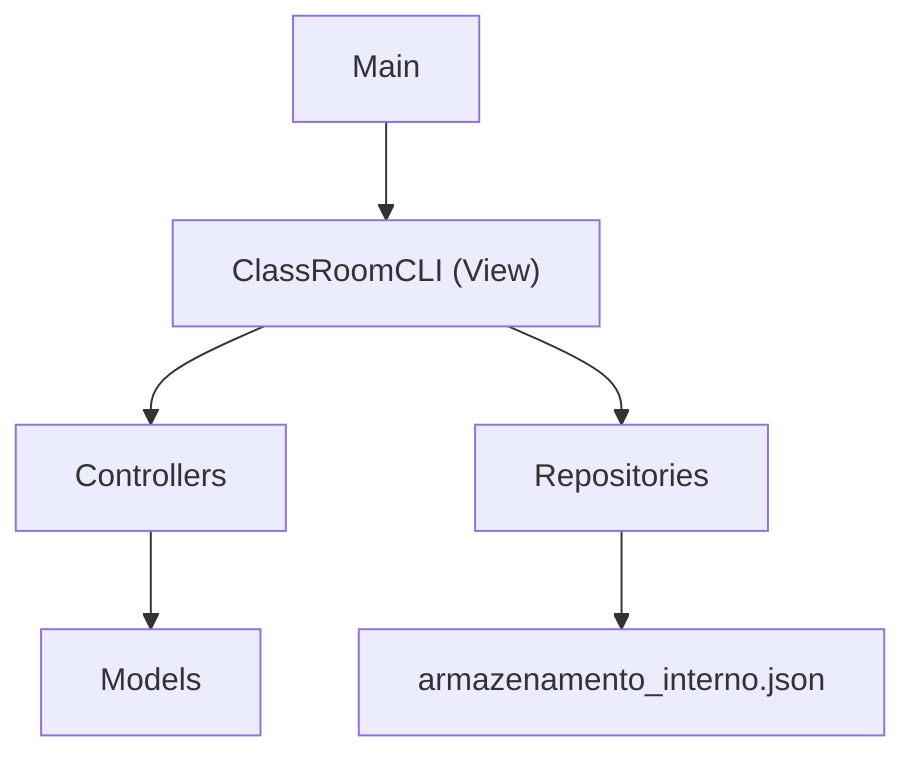

# Documentacao do Projeto ClassRoomPB

## 1. Visao Geral

O **ClassRoomPB** e um sistema academico simplificado desenvolvido em Java para a disciplina de Engenharia de Software II. O sistema usa interface de linha de comando (CLI), persistencia local em arquivo JSON e organizacao baseada no padrao MVC.

O projeto cobre atualmente:

- Cadastro e autenticacao de usuarios.
- Controle de perfis de acesso.
- Listagem de usuarios para administradores.
- Cadastro e listagem de cursos.
- Cadastro e listagem de disciplinas vinculadas a cursos existentes.
- Cadastro, ativacao e encerramento de periodos letivos.
- Persistencia local dos dados.
- Testes automatizados com JUnit 5.
- Geracao automatica do relatorio `TESTE.md` ao rodar a suite de testes Maven.

O projeto nao utiliza API web, banco de dados externo ou interface grafica. Toda interacao acontece pelo terminal.

## 2. Tecnologias Utilizadas

- **Java 11** como versao de compilacao definida no Maven.
- **Maven** para compilacao, execucao, testes e gerenciamento de dependencias.
- **JUnit 5.10.2** para testes automatizados.
- **JSON local** como mecanismo de persistencia.
- **CLI** com `Scanner` para entrada de dados pelo terminal.
- **maven-surefire-plugin** para execucao e geracao dos XMLs de teste.
- **exec-maven-plugin** para gerar automaticamente o `TESTE.md` na fase `test`.

As configuracoes principais estao em `pom.xml`.

## 3. Estrutura de Pastas

```text
projeto_esw_ClassRoomPB/
+-- pom.xml
+-- README.md
+-- DOCUMENTACAO.md
+-- TESTE.md
+-- armazenamento_interno.json
+-- releases/
+-- src/
|   +-- main/
|   |   +-- java/
|   |       +-- pb/
|   |           +-- classroom/
|   |               +-- Main.java
|   |               +-- controller/
|   |               +-- model/
|   |               +-- repository/
|   |               +-- view/
|   +-- test/
|       +-- java/
|           +-- pb/
|               +-- classroom/
|                   +-- controller/
|                   +-- model/
|                   +-- report/
+-- target/
```

## 4. Arquitetura MVC

O projeto segue uma divisao simples em camadas:



### Camada `model`

Contem as entidades e enumeracoes do dominio academico:

- `Usuario`
- `PerfilUsuario`
- `Curso`
- `Disciplina`
- `PeriodoLetivo`
- `Turma`
- `BlocoHorario`

Observacao importante: as classes `Aluno`, `Professor`, `Coordenador` e `Administrador` foram removidas. Agora existe apenas `Usuario`, que armazena diretamente seu `PerfilUsuario`.

### Camada `controller`

Contem as regras de fluxo e validacoes de acesso. Os controllers manipulam listas em memoria e retornam os objetos cadastrados; a persistencia e acionada pela CLI.

Controllers atuais:

- `AutenticacaoController`
- `CursoController`
- `DisciplinaController`
- `PeriodoLetivoController`

### Camada `repository`

Responsavel por carregar e salvar dados em `armazenamento_interno.json`.

Repositories atuais:

- `UsuarioRepository`
- `CursoRepository`
- `DisciplinaRepository`
- `PeriodoLetivoRepository`
- `ArmazenamentoJson`

### Camada `view`

Contem a interface de terminal:

- `ClassRoomCLI`

Essa classe exibe menus, le dados do usuario, chama controllers e aciona repositories para salvar os dados.

## 5. Execucao do Projeto

Na raiz do projeto:

```powershell
cd "C:\Users\rodri\Desktop\ESW2\projeto_esw_ClassRoomPB"
mvn compile exec:java
```

Classe principal:

```text
pb.classroom.Main
```

O `Main` instancia a CLI e chama o metodo `iniciar()`.

## 6. Execucao dos Testes e Relatorio TESTE

Para rodar todos os testes:

```powershell
mvn test
```

Ou, para limpar os arquivos gerados antes de testar:

```powershell
mvn clean test
```

Ao rodar `mvn test` ou `mvn clean test`, o Maven:

1. Executa os testes com o `maven-surefire-plugin`.
2. Gera arquivos XML em `target/surefire-reports`.
3. Executa a classe `pb.classroom.report.TesteMarkdownReport`.
4. Le os XMLs `TEST-*.xml`.
5. Reescreve automaticamente o arquivo `TESTE.md` com o resumo atualizado.

O `TESTE.md` mostra:

- Data e hora da geracao.
- Status geral do build.
- Total de testes.
- Falhas, erros e testes ignorados.
- Resultado por suite de teste.

## 7. Usuarios Iniciais e Persistencia

O arquivo de persistencia e:

```text
armazenamento_interno.json
```

Ele armazena:

- `usuarios`
- `disciplinas`
- `cursos`
- `periodosLetivos`

Caso o arquivo nao exista ou nao possua usuarios, o sistema cria automaticamente um administrador inicial:

```text
Nome: Administrador Padrao
Matricula: 0001
E-mail: admin@classroompb.com
Senha: admin123
Perfil: ADMINISTRADOR
```

## 8. Perfis de Usuario

Os perfis sao definidos no enum `PerfilUsuario`:

```java
ALUNO,
PROFESSOR,
COORDENADOR,
ADMINISTRADOR
```

O perfil nao depende mais de heranca. Cada objeto `Usuario` possui um campo `perfil`, que e usado pelos controllers e pela CLI para aplicar regras de acesso.

## 9. Funcionalidades por Perfil

A classe `ClassRoomCLI` mostra opcoes diferentes conforme o perfil logado.

### Sem login

- Login.
- Sair.

### Administrador

- Trocar login.
- Ver dados do usuario logado.
- Logout.
- Cadastrar usuario.
- Cadastrar curso.
- Listar cursos.
- Listar usuarios.

### Coordenador

- Trocar login.
- Ver dados do usuario logado.
- Logout.
- Cadastrar disciplina.
- Listar disciplinas.
- Listar cursos.
- Cadastrar periodo letivo.
- Listar periodos letivos.
- Ativar periodo letivo.
- Encerrar periodo letivo.

### Professor

- Trocar login.
- Ver dados do usuario logado.
- Logout.
- Listar disciplinas.
- Listar periodos letivos.

### Aluno

- Trocar login.
- Ver dados do usuario logado.
- Logout.
- Listar disciplinas.
- Listar periodos letivos.

## 10. Classes do Pacote `pb.classroom.model`

### `Usuario`

Classe concreta para todos os usuarios autenticaveis.

Atributos:

- `id`
- `perfil`
- `nome`
- `matricula`
- `email`
- `senha`
- `ativo`

Responsabilidades:

- Validar perfil obrigatorio.
- Validar nome obrigatorio.
- Validar matricula obrigatoria.
- Validar e-mail obrigatorio.
- Validar senha obrigatoria.
- Armazenar estado ativo/inativo.
- Implementar igualdade por `id`.

### `PerfilUsuario`

Enum que centraliza os papeis existentes no sistema:

- `ALUNO`
- `PROFESSOR`
- `COORDENADOR`
- `ADMINISTRADOR`

### `Curso`

Representa um curso cadastrado pelo administrador.

Atributos:

- `id`
- `nome`
- `codigo`

Regras:

- `id` nao pode ser nulo ou vazio.
- `nome` e obrigatorio.
- `codigo` e opcional.
- Igualdade e feita pelo `id`.

### `Disciplina`

Representa uma disciplina vinculada a um curso.

Atributos:

- `id`
- `codigo`
- `nome`
- `cargaHoraria`
- `creditos`
- `idCurso`
- `preRequisitosIds`

Regras:

- Codigo e obrigatorio.
- Nome e obrigatorio.
- Carga horaria deve ser positiva.
- Creditos devem ser positivos.
- ID do curso e obrigatorio.
- O curso informado deve existir na lista de cursos conhecida pelo `DisciplinaController`.
- Pre-requisitos sao opcionais.
- Pre-requisitos informados precisam existir.
- Uma disciplina nao pode ser pre-requisito dela mesma.
- Nao pode haver pre-requisito duplicado.
- A lista de pre-requisitos retornada e imutavel.

### `PeriodoLetivo`

Representa um periodo letivo, como `2026.2`.

Atributos:

- `id`
- `codigo`
- `ativo`

Regras:

- `id` nao pode ser nulo ou vazio.
- `codigo` e obrigatorio.
- `codigo` deve seguir o formato `AAAA.N`, por exemplo `2026.2`.
- Um periodo novo inicia como encerrado/inativo.
- Pode ser ativado com `ativar()`.
- Pode ser encerrado com `encerrar()`.
- Igualdade e feita pelo `id`.

### `BlocoHorario`

Representa um intervalo de aula em um dia da semana.

Atributos:

- `diaSemana`
- `horaInicio`
- `horaFim`

Regras:

- Dia da semana e obrigatorio.
- Hora de inicio e obrigatoria.
- Hora de fim e obrigatoria.
- Hora de fim deve ser depois da hora de inicio.
- Igualdade considera dia, inicio e fim.

### `Turma`

Representa uma turma ofertada para uma disciplina em um periodo letivo.

Atributos:

- `id`
- `idDisciplina`
- `idPeriodoLetivo`
- `idProfessor`
- `limiteVagas`
- `sala`
- `dataInicioAulas`
- `horarios`
- `cancelada`

Observacao: a classe `Turma` existe como base de dominio, mas ainda nao ha controller, repository ou menu completo para oferta de turmas.

## 11. Classes do Pacote `pb.classroom.controller`

### `AutenticacaoController`

Controla login, logout, sessao atual e cadastro de usuarios.

Principais metodos:

- `login(String identificador, String senha)`
- `cadastrarUsuario(PerfilUsuario perfil, String matricula, String nome, String senha)`
- `logout()`
- `isAutenticado()`
- `getUsuarioLogado()`
- `getUsuarios()`

Regras:

- Login aceita matricula ou e-mail.
- E-mail e comparado sem diferenciar maiusculas/minusculas.
- Senha precisa ser exatamente igual.
- Usuario inativo nao consegue logar.
- Apenas administrador autenticado pode cadastrar usuarios.
- Cadastro exige perfil, matricula, nome e senha.
- O e-mail e gerado automaticamente a partir do nome e perfil.
- Nao permite matricula duplicada.
- Nao permite e-mail gerado duplicado.
- `getUsuarios()` retorna lista imutavel.

Regra de e-mail automatico:

```text
Nome: Rodrigo Almeida Gomes
Perfil: ALUNO
E-mail: rodrigo.gomes@aluno.classroom.com

Nome: Rodrigo Almeida Gomes
Perfil: ADMINISTRADOR
E-mail: rodrigo.gomes@admin.classroom.com
```

Dominios por perfil:

- `ALUNO`: `@aluno.classroom.com`
- `PROFESSOR`: `@professor.classroom.com`
- `COORDENADOR`: `@coordenador.classroom.com`
- `ADMINISTRADOR`: `@admin.classroom.com`

### `CursoController`

Controla o cadastro de cursos.

Principais metodos:

- `cadastrarCurso(String nome, String codigo)`
- `getCursos()`

Regras:

- Apenas administrador autenticado pode cadastrar curso.
- Nome do curso e obrigatorio.
- Nao permite curso duplicado por nome.
- Nao permite codigo duplicado quando o codigo e informado.
- `getCursos()` retorna lista imutavel.

### `DisciplinaController`

Controla o cadastro de disciplinas.

Principais metodos:

- `cadastrarDisciplina(String codigo, String nome, int cargaHoraria, int creditos, String idCurso, List<String> preRequisitosIds)`
- `getDisciplinas()`

Regras:

- Apenas coordenador autenticado pode cadastrar disciplina.
- Codigo da disciplina e obrigatorio.
- Nao permite disciplina duplicada por codigo.
- O `idCurso` e obrigatorio.
- O curso informado precisa existir.
- Cursos cadastrados durante a mesma execucao sao reconhecidos pelo controller.
- Pre-requisitos informados precisam existir na lista atual de disciplinas.
- `getDisciplinas()` retorna lista imutavel.

### `PeriodoLetivoController`

Controla cadastro e alteracao de status dos periodos letivos.

Principais metodos:

- `cadastrarPeriodoLetivo(String codigo)`
- `ativarPeriodoLetivo(String id)`
- `encerrarPeriodoLetivo(String id)`
- `getPeriodosLetivos()`

Regras:

- Apenas coordenador autenticado pode gerenciar periodos letivos.
- Codigo e obrigatorio.
- Codigo nao pode ser duplicado.
- O formato do codigo e validado pelo model `PeriodoLetivo`.
- So e possivel ativar ou encerrar periodo existente.
- `getPeriodosLetivos()` retorna lista imutavel.

## 12. Classes do Pacote `pb.classroom.repository`

### `ArmazenamentoJson`

Classe utilitaria interna para manipular arrays dentro do arquivo JSON.

Responsabilidades:

- Extrair arrays por nome de campo.
- Retornar `[]` quando um campo ainda nao existe.
- Montar o documento completo de persistencia com usuarios, disciplinas, cursos e periodos letivos.
- Validar se os conteudos salvos como arrays comecam com `[` e terminam com `]`.

Observacao tecnica: a implementacao usa manipulacao manual de texto e expressoes regulares. Funciona para a estrutura atual simples, mas nao substitui uma biblioteca JSON completa.

### `UsuarioRepository`

Carrega e salva usuarios.

Responsabilidades:

- Ler usuarios de `armazenamento_interno.json`.
- Criar administrador inicial se nao houver arquivo ou lista de usuarios.
- Converter JSON em objetos `Usuario`.
- Converter objetos `Usuario` em JSON.
- Preservar disciplinas, cursos e periodos letivos ao salvar usuarios.

### `CursoRepository`

Carrega e salva cursos.

Responsabilidades:

- Ler o array `cursos`.
- Converter JSON em objetos `Curso`.
- Converter cursos em JSON.
- Preservar usuarios, disciplinas e periodos letivos ao salvar cursos.

### `DisciplinaRepository`

Carrega e salva disciplinas.

Responsabilidades:

- Ler o array `disciplinas`.
- Converter JSON em objetos `Disciplina`.
- Converter disciplinas em JSON.
- Salvar pre-requisitos como lista de IDs.
- Preservar usuarios, cursos e periodos letivos ao salvar disciplinas.

### `PeriodoLetivoRepository`

Carrega e salva periodos letivos.

Responsabilidades:

- Ler o array `periodosLetivos`.
- Converter JSON em objetos `PeriodoLetivo`.
- Converter periodos em JSON.
- Preservar usuarios, disciplinas e cursos ao salvar periodos.

## 13. Classe `ClassRoomCLI`

`ClassRoomCLI` e a interface de linha de comando do sistema.

Responsabilidades:

- Inicializar repositories.
- Carregar dados salvos.
- Criar controllers.
- Exibir menu principal.
- Exibir funcionalidades conforme o perfil do usuario.
- Ler entradas pelo terminal.
- Tratar excecoes de validacao e exibir mensagens.
- Salvar dados apos cadastros ou alteracoes.

Fluxos implementados:

- Login.
- Ver dados do usuario logado.
- Logout.
- Cadastro de usuario.
- Listagem de usuarios.
- Cadastro de disciplina.
- Listagem de disciplinas.
- Cadastro de curso.
- Listagem de cursos.
- Cadastro de periodo letivo.
- Listagem de periodos letivos.
- Ativacao de periodo letivo.
- Encerramento de periodo letivo.

## 14. Menu da Aplicacao

Opcoes existentes no codigo:

```text
1  - Login / Trocar login
2  - Ver dados do usuario logado
3  - Logout
4  - Cadastrar usuario
5  - Cadastrar disciplina
6  - Listar disciplinas
7  - Cadastrar curso
8  - Listar cursos
9  - Cadastrar periodo letivo
10 - Listar periodos letivos
11 - Ativar periodo letivo
12 - Encerrar periodo letivo
13 - Listar usuarios
0  - Sair
```

Nem todas as opcoes aparecem para todos os perfis. A exibicao e filtrada no metodo `exibirFuncionalidadesPorPerfil`.

Mesmo que o usuario digite uma opcao escondida, os metodos tambem validam o perfil antes de executar a acao.

## 15. Fluxo de Cadastro de Usuario

1. Usuario precisa estar autenticado.
2. Usuario precisa ter perfil `ADMINISTRADOR`.
3. A CLI solicita o tipo de usuario:
   - Aluno
   - Professor
   - Coordenador
   - Administrador
4. A CLI solicita matricula, nome completo e senha.
5. O `AutenticacaoController` valida:
   - Perfil obrigatorio.
   - Matricula obrigatoria.
   - Nome obrigatorio.
   - Senha obrigatoria.
   - Duplicidade de matricula.
   - Duplicidade do e-mail gerado.
6. O e-mail e gerado automaticamente pelo primeiro e ultimo nome e pelo perfil.
7. O usuario e criado.
8. O `UsuarioRepository` salva a lista no JSON.

## 16. Fluxo de Login

1. A CLI solicita matricula/e-mail e senha.
2. O `AutenticacaoController` procura usuario por matricula ou e-mail.
3. Se encontrar e a senha estiver correta, salva o usuario como sessao atual.
4. Se o usuario estiver inativo, o login e negado.
5. Se os dados estiverem incorretos, uma excecao e lancada e a CLI mostra a mensagem.

## 17. Fluxo de Cadastro de Curso

1. Usuario precisa estar autenticado.
2. Usuario precisa ter perfil `ADMINISTRADOR`.
3. A CLI solicita nome e codigo opcional.
4. O `CursoController` valida:
   - Administrador autenticado.
   - Nome obrigatorio.
   - Nome nao duplicado.
   - Codigo nao duplicado quando informado.
5. O curso e criado.
6. O `CursoRepository` salva os cursos no JSON.

## 18. Fluxo de Cadastro de Disciplina

1. Usuario precisa estar autenticado.
2. Usuario precisa ter perfil `COORDENADOR`.
3. A CLI exibe cursos existentes para que o coordenador escolha o curso da disciplina.
4. A CLI exibe disciplinas existentes para possivel uso como pre-requisito.
5. A CLI solicita:
   - Codigo.
   - Nome.
   - Carga horaria.
   - Creditos.
   - ID do curso.
   - IDs dos pre-requisitos.
6. A CLI converte carga horaria e creditos para inteiro.
7. O `DisciplinaController` valida:
   - Coordenador autenticado.
   - Codigo obrigatorio.
   - Codigo nao duplicado.
   - Curso existente.
   - Pre-requisitos existentes.
8. O model `Disciplina` valida:
   - Nome obrigatorio.
   - Carga horaria positiva.
   - Creditos positivos.
   - ID de curso obrigatorio.
   - Pre-requisitos sem duplicidade.
9. O `DisciplinaRepository` salva as disciplinas no JSON.

## 19. Fluxo de Cadastro e Status de Periodo Letivo

Cadastro:

1. Usuario precisa estar autenticado.
2. Usuario precisa ter perfil `COORDENADOR`.
3. A CLI solicita o codigo do periodo, por exemplo `2026.2`.
4. O `PeriodoLetivoController` valida:
   - Coordenador autenticado.
   - Codigo obrigatorio.
   - Codigo nao duplicado.
5. O model `PeriodoLetivo` valida o formato.
6. O periodo e criado como inativo/encerrado.
7. O `PeriodoLetivoRepository` salva a lista no JSON.

Ativacao/encerramento:

1. Usuario precisa ter perfil `COORDENADOR`.
2. A CLI lista os periodos existentes.
3. A CLI solicita o ID do periodo.
4. O controller busca o periodo.
5. O status e alterado.
6. A lista e salva novamente no JSON.

## 20. Testes Automatizados

Os testes usam JUnit 5 e ficam em `src/test/java`.

### `UsuarioAtribuicaoTest`

Verifica:

- `Usuario` guarda o perfil informado sem depender de subclasses.
- Perfil nulo e rejeitado.

### `AutenticacaoControllerLoginTest`

Verifica:

- Login por matricula.
- Login por e-mail sem diferenciar maiusculas/minusculas.
- Credenciais invalidas.
- Usuario inativo.
- Logout.
- Campos obrigatorios.
- Imutabilidade da lista de usuarios.

### `AutenticacaoControllerCadastroTest`

Verifica:

- Administrador cadastra usuario.
- E-mail e gerado automaticamente a partir do nome e perfil.
- Administrador usa dominio `admin.classroom.com`.
- Usuario nao administrador nao cadastra.
- Campos obrigatorios no cadastro.
- Duplicidade de matricula.
- Duplicidade de e-mail gerado.

### `CursoControllerTest`

Verifica:

- Administrador autenticado cadastra curso.
- Usuario sem perfil administrador nao cadastra curso.
- Nome duplicado nao e permitido.
- Codigo duplicado nao e permitido.
- Campos obrigatorios.
- Lista retornada por `getCursos()` e imutavel.

### `DisciplinaControllerTest`

Verifica:

- Coordenador cadastra disciplina para curso existente.
- Curso inexistente impede cadastro de disciplina.
- Usuario sem perfil coordenador nao cadastra disciplina.
- Curso adicionado apos criar o controller tambem e reconhecido.

### `PeriodoLetivoControllerTest`

Verifica:

- Coordenador autenticado cadastra periodo letivo.
- Usuario sem perfil coordenador nao cadastra periodo.
- Periodo pode ser ativado.
- Periodo pode ser encerrado.
- Periodo duplicado nao e permitido.
- Formato invalido e rejeitado.

### `TesteMarkdownReport`

Classe auxiliar de teste/relatorio. Ela nao e uma suite JUnit; e executada pelo `exec-maven-plugin` na fase `test`.

Responsabilidades:

- Ler `target/surefire-reports/TEST-*.xml`.
- Somar testes, falhas, erros e ignorados.
- Gerar o arquivo `TESTE.md`.

## 21. Requisitos Funcionais Atendidos Parcial ou Totalmente

### RF01 - Cadastro de alunos, professores, coordenadores e administradores

Implementado via `AutenticacaoController.cadastrarUsuario`, acessivel pela CLI para administradores. Os tipos sao representados pelo campo `PerfilUsuario` em `Usuario`.

### RF02 - Login com matricula/e-mail e senha

Implementado via `AutenticacaoController.login`.

### RF03 - Validacao de perfis e funcionalidades diferentes

Implementado em duas camadas:

- CLI exibe opcoes conforme perfil.
- Controllers bloqueiam acoes para perfis nao autorizados.

### RF04 - Impedir cadastro duplicado por matricula ou e-mail

Implementado em `AutenticacaoController`. Como o e-mail agora e gerado automaticamente, a duplicidade e verificada sobre o e-mail gerado.

### RF05 - Administrador cadastra cursos

Implementado em `CursoController`, `CursoRepository` e CLI.

### RF06 - Coordenador cadastra disciplinas

Implementado em `DisciplinaController` e CLI.

### RF07 - Disciplina possui codigo, nome, carga horaria, creditos e pre-requisitos opcionais

Implementado no model `Disciplina`, com validacao adicional de curso existente no controller.

### RF08 - Coordenador cadastra periodos letivos

Implementado em `PeriodoLetivoController`, `PeriodoLetivoRepository` e CLI.

### RF09 - Ativar ou encerrar periodo letivo

Implementado por `ativarPeriodoLetivo` e `encerrarPeriodoLetivo`.

### RF10 a RF14 - Oferta de turmas

Ainda nao ha fluxo completo. Existe apenas a classe de dominio `Turma` e a classe `BlocoHorario`, que servem como base para implementacao futura.

## 22. Limitacoes Atuais

Alguns pontos ainda nao estao implementados completamente:

- Nao existe controller/repository/CLI para oferta de turmas.
- Nao existe cadastro de professores associado a turmas.
- Nao existe regra de choque de horario para professor.
- Nao existe alteracao ou cancelamento de turma pela CLI.
- Nao existe matricula de alunos em turmas.
- Nao existe lista de espera.
- Nao existe frequencia.
- Nao existe notas, media, recuperacao ou situacao final.
- Nao existe historico academico.
- A persistencia JSON e manual e simples, baseada em texto/regex.

## 23. Pontos de Atencao Tecnica

### Persistencia manual

Os repositories fazem parsing manual de JSON. Isso e suficiente para o formato atual, mas pode ficar fragil se o arquivo crescer ou se objetos ficarem mais complexos.

### Senhas em texto puro

As senhas sao salvas diretamente no JSON. Para um sistema real, isso nao seria adequado. Como o projeto e academico e simplificado, o foco atual esta nas regras funcionais.

### Validacao dupla de permissao

A CLI esconde opcoes por perfil, mas os controllers tambem validam permissoes. Isso e importante porque nao basta esconder a opcao na tela: a regra precisa estar protegida no fluxo de negocio.

### Estado em memoria

Ao iniciar a CLI, os repositories carregam listas em memoria. Depois de cada alteracao, a CLI chama o repository correspondente para salvar no JSON.

### Relatorio de testes versionado

O arquivo `TESTE.md` e reescrito sempre que `mvn test` ou `mvn clean test` termina com sucesso. Por isso, ele pode aparecer como modificado no Git apos uma nova execucao de testes, mesmo que o codigo nao tenha sido alterado.

## 24. Como Evoluir o Projeto

Proximos passos naturais:

1. Criar `TurmaController`.
2. Criar `TurmaRepository`.
3. Adicionar opcoes na CLI para ofertar, alterar e cancelar turmas.
4. Validar se disciplina, periodo letivo e professor existem antes de criar turma.
5. Validar que professor responsavel possui perfil `PROFESSOR`.
6. Implementar regra de choque de horario para professor.
7. Criar testes para turma e blocos de horario.
8. Melhorar a interface do projeto, seja com uma CLI mais amigavel, uma interface desktop ou uma interface web.

Proximos passos para releases futuras:

1. Consulta de turmas por aluno.
2. Solicitacao de matricula.
3. Controle de vagas.
4. Lista de espera.
5. Frequencia.
6. Notas.
7. Historico.
8. Relatorios academicos.

## 25. Comandos Uteis

Compilar:

```powershell
mvn compile
```

Executar:

```powershell
mvn compile exec:java
```

Rodar testes e atualizar `TESTE.md`:

```powershell
mvn test
```

Limpar e rodar todos os testes:

```powershell
mvn clean test
```

Limpar arquivos gerados:

```powershell
mvn clean
```

Gerar pacote:

```powershell
mvn package
```

## 26. Resumo Final

O ClassRoomPB esta estruturado em MVC, possui dominio academico inicial, autenticacao, controle de perfis, persistencia local e testes automatizados para os fluxos principais ja implementados.

O estado atual cobre cadastro/login, perfis, usuarios, cursos, disciplinas vinculadas a cursos existentes, periodos letivos e relatorio automatico de testes. A maior pendencia funcional ainda e a implementacao completa de turmas e suas validacoes associadas.
