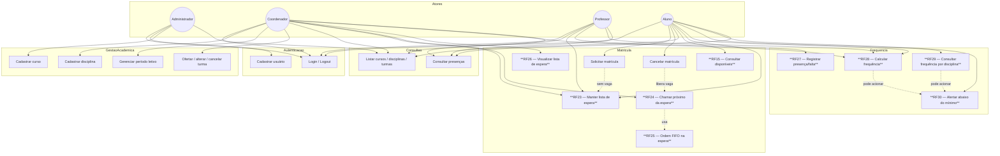

# Diagrama de Casos de Uso — ClassRoomPB

```mermaid
flowchart TB
    subgraph Atores
        ADM((Administrador))
        COORD((Coordenador))
        PROF((Professor))
        ALU((Aluno))
    end

    subgraph Autenticacao
        UC01[Login / Logout]
        UC02[Cadastrar usuário]
    end

    subgraph GestaoAcademica
        UC03[Cadastrar curso]
        UC04[Cadastrar disciplina]
        UC05[Gerenciar período letivo]
        UC06[Ofertar / alterar / cancelar turma]
    end

    subgraph Matricula
        UC07[Solicitar matrícula]
        UC08[Cancelar matrícula]
        UC15["**RF15 — Consultar disponíveis**"]
        UC23["**RF23 — Manter lista de espera**"]
        UC24["**RF24 — Chamar próximo da espera**"]
        UC25["**RF25 — Ordem FIFO na espera**"]
        UC26["**RF26 — Visualizar lista de espera**"]
    end

    subgraph Frequencia
        UC27["**RF27 — Registrar presença/falta**"]
        UC28["**RF28 — Calcular frequência**"]
        UC29["**RF29 — Consultar frequência por disciplina**"]
        UC30["**RF30 — Alertar abaixo do mínimo**"]
    end

    subgraph Consultas
        UC09[Listar cursos / disciplinas / turmas]
        UC10[Consultar presenças]
    end

    ADM --> UC01
    ADM --> UC02
    ADM --> UC03
    ADM --> UC09

    COORD --> UC01
    COORD --> UC04
    COORD --> UC05
    COORD --> UC06
    COORD --> UC09
    COORD --> UC23
    COORD --> UC24
    COORD --> UC26
    COORD --> UC28
    COORD --> UC10

    PROF --> UC01
    PROF --> UC09
    PROF --> UC23
    PROF --> UC27
    PROF --> UC28
    PROF --> UC10

    ALU --> UC01
    ALU --> UC07
    ALU --> UC08
    ALU --> UC09
    ALU --> UC15
    ALU --> UC23
    ALU --> UC28
    ALU --> UC29
    ALU --> UC30
    ALU --> UC10

    UC07 -.->|sem vaga| UC23
    UC08 -.->|libera vaga| UC24
    UC24 -.->|usa| UC25
    UC28 -.->|pode acionar| UC30
    UC29 -.->|pode acionar| UC30
```
