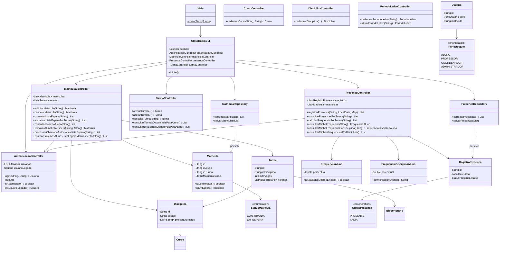

# Diagrama de Classes — ClassRoomPB

```mermaid
classDiagram
    direction TB

    class Main {
        +main(String[] args)$
    }

    class ClassRoomCLI {
        -Scanner scanner
        -AutenticacaoController autenticacaoController
        -MatriculaController matriculaController
        -PresencaController presencaController
        -TurmaController turmaController
        +iniciar()
    }

    class AutenticacaoController {
        -List~Usuario~ usuarios
        -Usuario usuarioLogado
        +login(String, String) Usuario
        +logout()
        +isAutenticado() boolean
        +getUsuarioLogado() Usuario
    }

    class MatriculaController {
        -List~Matricula~ matriculas
        -List~Turma~ turmas
        +solicitarMatricula(String) Matricula
        +cancelarMatricula(String) Matricula
        +consultarListaEspera(String) List
        +visualizarListaEsperaPorTurma(String) List
        +consultarPosicaoAluno(String) int
        +removerAlunoListaEspera(String, String) Matricula
        +processarChamadaAutomaticaListaEspera(String) List
        +chamarProximosAlunosListaEsperaManualmente(String) List
    }

    class PresencaController {
        -List~RegistroPresenca~ registros
        -List~Matricula~ matriculas
        +registrarPresenca(String, LocalDate, Map) List
        +consultarPresencasPorTurma(String) List
        +calcularFrequenciaPorTurma(String) List
        +consultarMinhaFrequencia(String) FrequenciaAluno
        +consultarMinhaFrequenciaPorDisciplina(String) FrequenciaDisciplinaAluno
        +consultarMinhasFrequenciasPorDisciplina() List
    }

    class TurmaController {
        +ofertarTurma(...) Turma
        +alterarTurma(...) Turma
        +cancelarTurma(String) Turma
        +consultarTurmasDisponiveisParaAluno() List
        +consultarDisciplinasDisponiveisParaAluno() List
    }

    class CursoController {
        +cadastrarCurso(String, String) Curso
    }

    class DisciplinaController {
        +cadastrarDisciplina(...) Disciplina
    }

    class PeriodoLetivoController {
        +cadastrarPeriodoLetivo(String) PeriodoLetivo
        +ativarPeriodoLetivo(String) PeriodoLetivo
    }

    class Usuario {
        -String id
        -PerfilUsuario perfil
        -String matricula
    }

    class Matricula {
        -String id
        -String idAluno
        -String idTurma
        -StatusMatricula status
        +isConfirmada() boolean
        +isEmEspera() boolean
    }

    class Turma {
        -String id
        -String idDisciplina
        -int limiteVagas
        -List~BlocoHorario~ horarios
    }

    class Disciplina {
        -String id
        -String codigo
        -List~String~ preRequisitosIds
    }

    class RegistroPresenca {
        -String id
        -LocalDate data
        -StatusPresenca status
    }

    class FrequenciaAluno {
        -double percentual
        +isAbaixoDoMinimoExigido() boolean
    }

    class FrequenciaDisciplinaAluno {
        -double percentual
        +getMensagemAlerta() String
    }

    class StatusMatricula {
        <<enumeration>>
        CONFIRMADA
        EM_ESPERA
    }

    class StatusPresenca {
        <<enumeration>>
        PRESENTE
        FALTA
    }

    class PerfilUsuario {
        <<enumeration>>
        ALUNO
        PROFESSOR
        COORDENADOR
        ADMINISTRADOR
    }

    class MatriculaRepository {
        +carregarMatriculas() List
        +salvarMatriculas(List)
    }

    class PresencaRepository {
        +carregarPresencas() List
        +salvarPresencas(List)
    }

    Main --> ClassRoomCLI
    ClassRoomCLI --> AutenticacaoController
    ClassRoomCLI --> MatriculaController
    ClassRoomCLI --> PresencaController
    ClassRoomCLI --> TurmaController
    ClassRoomCLI --> MatriculaRepository
    ClassRoomCLI --> PresencaRepository

    MatriculaController --> AutenticacaoController
    MatriculaController --> Matricula
    MatriculaController --> Turma
    MatriculaController --> Disciplina

    PresencaController --> AutenticacaoController
    PresencaController --> RegistroPresenca
    PresencaController --> FrequenciaAluno
    PresencaController --> FrequenciaDisciplinaAluno

    Matricula --> StatusMatricula
    RegistroPresenca --> StatusPresenca
    Usuario --> PerfilUsuario
    Turma --> BlocoHorario
    Turma --> Disciplina
    Disciplina --> Curso

    MatriculaRepository ..> Matricula : persiste
    PresencaRepository ..> RegistroPresenca : persiste
```
