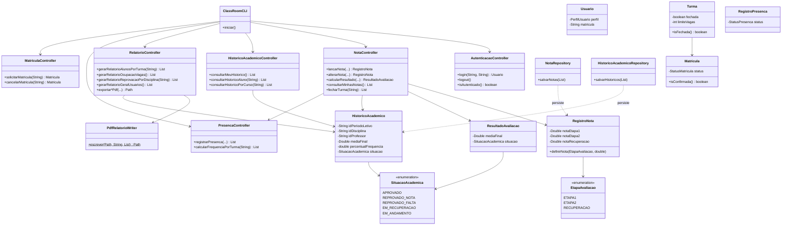

# Diagrama de Classes — ClassRoomPB

```mermaid
classDiagram
    direction TB

    class ClassRoomCLI {
        +iniciar()
    }

    class AutenticacaoController {
        +login(String, String) Usuario
        +logout()
        +isAutenticado() boolean
    }

    class NotaController {
        +lancarNota(...) RegistroNota
        +alterarNota(...) RegistroNota
        +calcularResultado(...) ResultadoAvaliacao
        +consultarMinhasNotas() List
        +fecharTurma(String) List
    }

    class HistoricoAcademicoController {
        +consultarMeuHistorico() List
        +consultarHistoricoAluno(String) List
        +consultarHistoricoPorCurso(String) List
    }

    class RelatorioController {
        +gerarRelatorioAlunosPorTurma(String) List
        +gerarRelatorioOcupacaoVagas() List
        +gerarRelatorioReprovacaoPorDisciplina(String) List
        +gerarRelatorioGeralUsuarios() List
        +exportar*Pdf(...) Path
    }

    class PresencaController {
        +registrarPresenca(...) List
        +calcularFrequenciaPorTurma(String) List
    }

    class MatriculaController {
        +solicitarMatricula(String) Matricula
        +cancelarMatricula(String) Matricula
    }

    class PdfRelatorioWriter {
        +escrever(Path, String, List)$ Path
    }

    class Usuario {
        -PerfilUsuario perfil
        -String matricula
    }

    class Turma {
        -boolean fechada
        -int limiteVagas
        +isFechada() boolean
    }

    class Matricula {
        -StatusMatricula status
        +isConfirmada() boolean
    }

    class RegistroNota {
        -Double notaEtapa1
        -Double notaEtapa2
        -Double notaRecuperacao
        +definirNota(EtapaAvaliacao, double)
    }

    class ResultadoAvaliacao {
        -Double mediaFinal
        -SituacaoAcademica situacao
    }

    class HistoricoAcademico {
        -String idPeriodoLetivo
        -String idDisciplina
        -String idProfessor
        -Double mediaFinal
        -double percentualFrequencia
        -SituacaoAcademica situacao
    }

    class RegistroPresenca {
        -StatusPresenca status
    }

    class EtapaAvaliacao {
        <<enumeration>>
        ETAPA1
        ETAPA2
        RECUPERACAO
    }

    class SituacaoAcademica {
        <<enumeration>>
        APROVADO
        REPROVADO_NOTA
        REPROVADO_FALTA
        EM_RECUPERACAO
        EM_ANDAMENTO
    }

    class NotaRepository {
        +salvarNotas(List)
    }

    class HistoricoAcademicoRepository {
        +salvarHistoricos(List)
    }

    ClassRoomCLI --> AutenticacaoController
    ClassRoomCLI --> NotaController
    ClassRoomCLI --> HistoricoAcademicoController
    ClassRoomCLI --> RelatorioController
    ClassRoomCLI --> PresencaController
    ClassRoomCLI --> MatriculaController

    NotaController --> RegistroNota
    NotaController --> ResultadoAvaliacao
    NotaController --> HistoricoAcademico
    NotaController --> PresencaController
    HistoricoAcademicoController --> HistoricoAcademico
    RelatorioController --> PdfRelatorioWriter
    RelatorioController --> HistoricoAcademico

    RegistroNota --> EtapaAvaliacao
    ResultadoAvaliacao --> SituacaoAcademica
    HistoricoAcademico --> SituacaoAcademica
    Turma --> Matricula
    NotaRepository ..> RegistroNota : persiste
    HistoricoAcademicoRepository ..> HistoricoAcademico : persiste
```
