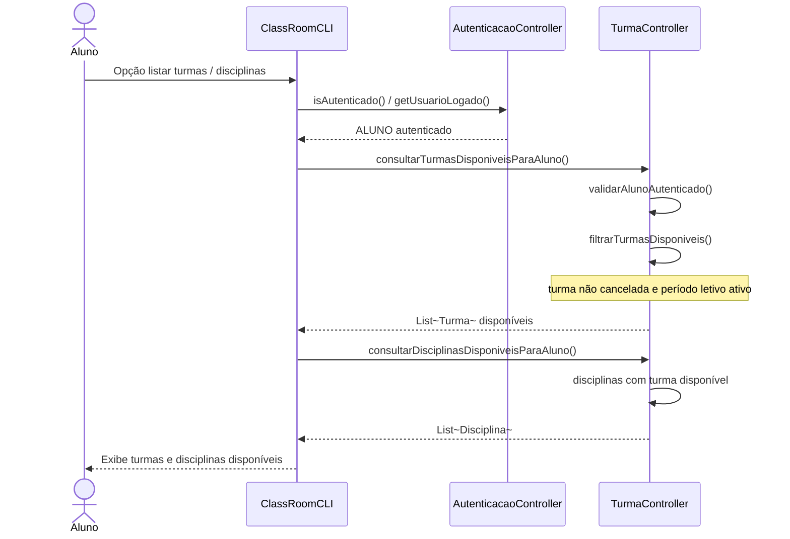

# Diagrama de Sequência — RF15

**Requisito:** O aluno deve poder consultar disciplinas/turmas disponíveis.

```mermaid
sequenceDiagram
    actor Aluno
    participant CLI as ClassRoomCLI
    participant Auth as AutenticacaoController
    participant Turma as TurmaController

    Aluno ->> CLI: Opção listar turmas / disciplinas
    CLI ->> Auth: isAutenticado() / getUsuarioLogado()
    Auth -->> CLI: ALUNO autenticado
    CLI ->> Turma: consultarTurmasDisponiveisParaAluno()
    Turma ->> Turma: validarAlunoAutenticado()
    Turma ->> Turma: filtrarTurmasDisponiveis()
    Note over Turma: turma não cancelada e período letivo ativo
    Turma -->> CLI: List~Turma~ disponíveis
    CLI ->> Turma: consultarDisciplinasDisponiveisParaAluno()
    Turma ->> Turma: disciplinas com turma disponível
    Turma -->> CLI: List~Disciplina~
    CLI -->> Aluno: Exibe turmas e disciplinas disponíveis
```
