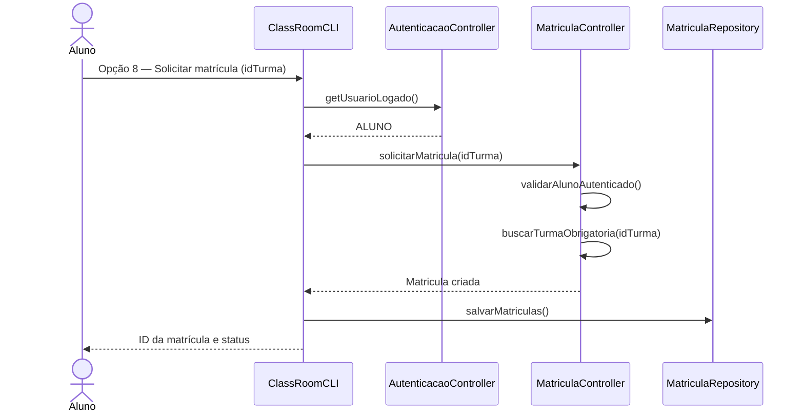

# Diagrama de Sequência — RF16

**Requisito:** O aluno deve poder solicitar matrícula em uma turma.

```mermaid
sequenceDiagram
    actor Aluno
    participant CLI as ClassRoomCLI
    participant Auth as AutenticacaoController
    participant Mat as MatriculaController
    participant Repo as MatriculaRepository

    Aluno ->> CLI: Opção 8 — Solicitar matrícula (idTurma)
    CLI ->> Auth: getUsuarioLogado()
    Auth -->> CLI: ALUNO
    CLI ->> Mat: solicitarMatricula(idTurma)
    Mat ->> Mat: validarAlunoAutenticado()
    Mat ->> Mat: buscarTurmaObrigatoria(idTurma)
    Mat -->> CLI: Matricula criada
    CLI ->> Repo: salvarMatriculas()
    CLI -->> Aluno: ID da matrícula e status
```
