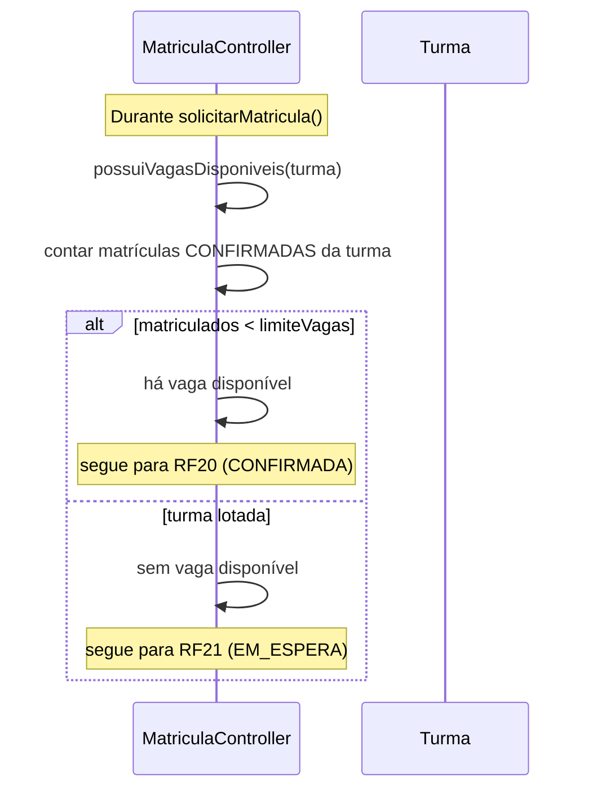

# Diagrama de Sequência — RF17

**Requisito:** O sistema deve verificar se há vagas disponíveis.

```mermaid
sequenceDiagram
    participant Mat as MatriculaController
    participant Turma as Turma

    Note over Mat: Durante solicitarMatricula()
    Mat ->> Mat: possuiVagasDisponiveis(turma)
    Mat ->> Mat: contar matrículas CONFIRMADAS da turma
    alt matriculados < limiteVagas
        Mat ->> Mat: há vaga disponível
        Note over Mat: segue para RF20 (CONFIRMADA)
    else turma lotada
        Mat ->> Mat: sem vaga disponível
        Note over Mat: segue para RF21 (EM_ESPERA)
    end
```
