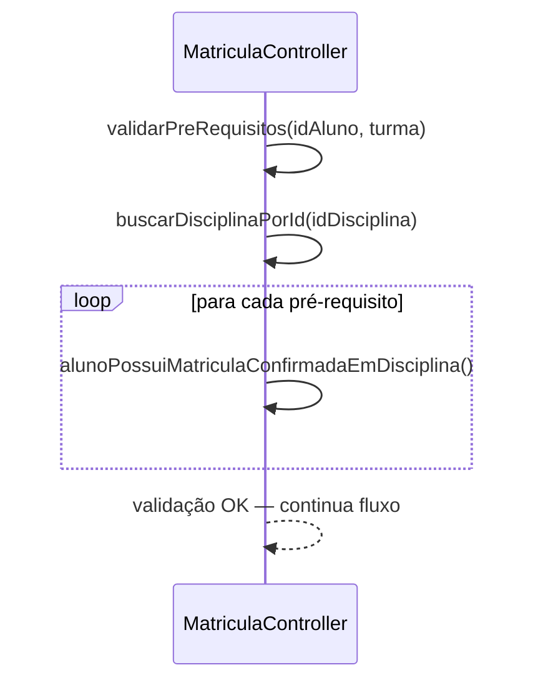
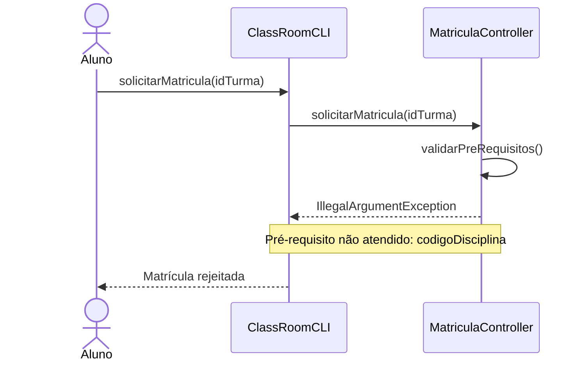

# Diagrama de Sequência — RF18

**Requisito:** O sistema deve verificar se o aluno cumpriu os pré-requisitos da disciplina.

## Pré-requisito atendido

```mermaid
sequenceDiagram
    participant Mat as MatriculaController

    Mat ->> Mat: validarPreRequisitos(idAluno, turma)
    Mat ->> Mat: buscarDisciplinaPorId(idDisciplina)
    loop para cada pré-requisito
        Mat ->> Mat: alunoPossuiMatriculaConfirmadaEmDisciplina()
    end
    Mat -->> Mat: validação OK — continua fluxo
```

## Pré-requisito não atendido

```mermaid
sequenceDiagram
    actor Aluno
    participant CLI as ClassRoomCLI
    participant Mat as MatriculaController

    Aluno ->> CLI: solicitarMatricula(idTurma)
    CLI ->> Mat: solicitarMatricula(idTurma)
    Mat ->> Mat: validarPreRequisitos()
    Mat -->> CLI: IllegalArgumentException
    Note over Mat,CLI: Pré-requisito não atendido: codigoDisciplina
    CLI -->> Aluno: Matrícula rejeitada
```
