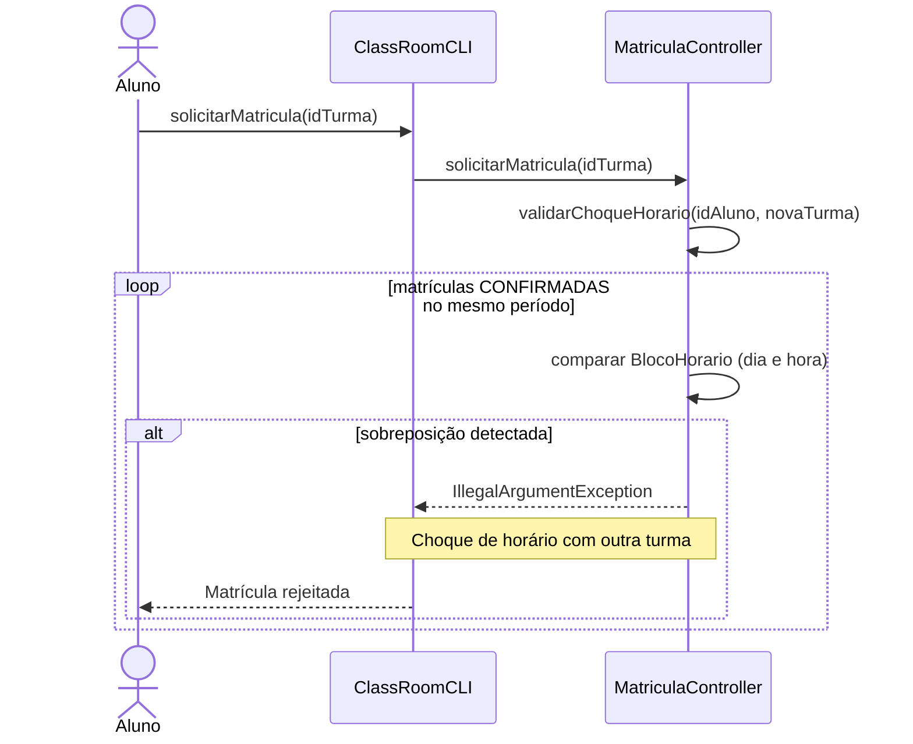

# Diagrama de Sequência — RF19

**Requisito:** O sistema deve impedir choque de horário entre turmas do mesmo aluno.

```mermaid
sequenceDiagram
    actor Aluno
    participant CLI as ClassRoomCLI
    participant Mat as MatriculaController

    Aluno ->> CLI: solicitarMatricula(idTurma)
    CLI ->> Mat: solicitarMatricula(idTurma)
    Mat ->> Mat: validarChoqueHorario(idAluno, novaTurma)
    loop matrículas CONFIRMADAS no mesmo período
        Mat ->> Mat: comparar BlocoHorario (dia e hora)
        alt sobreposição detectada
            Mat -->> CLI: IllegalArgumentException
            Note over Mat,CLI: Choque de horário com outra turma
            CLI -->> Aluno: Matrícula rejeitada
        end
    end
```
