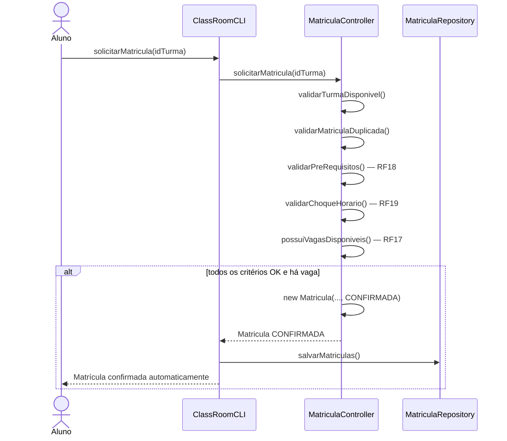

# Diagrama de Sequência — RF20

**Requisito:** O sistema deve confirmar matrícula automaticamente quando todos os critérios forem atendidos.

```mermaid
sequenceDiagram
    actor Aluno
    participant CLI as ClassRoomCLI
    participant Mat as MatriculaController
    participant Repo as MatriculaRepository

    Aluno ->> CLI: solicitarMatricula(idTurma)
    CLI ->> Mat: solicitarMatricula(idTurma)
    Mat ->> Mat: validarTurmaDisponivel()
    Mat ->> Mat: validarMatriculaDuplicada()
    Mat ->> Mat: validarPreRequisitos() — RF18
    Mat ->> Mat: validarChoqueHorario() — RF19
    Mat ->> Mat: possuiVagasDisponiveis() — RF17
    alt todos os critérios OK e há vaga
        Mat ->> Mat: new Matricula(..., CONFIRMADA)
        Mat -->> CLI: Matricula CONFIRMADA
        CLI ->> Repo: salvarMatriculas()
        CLI -->> Aluno: Matrícula confirmada automaticamente
    end
```
