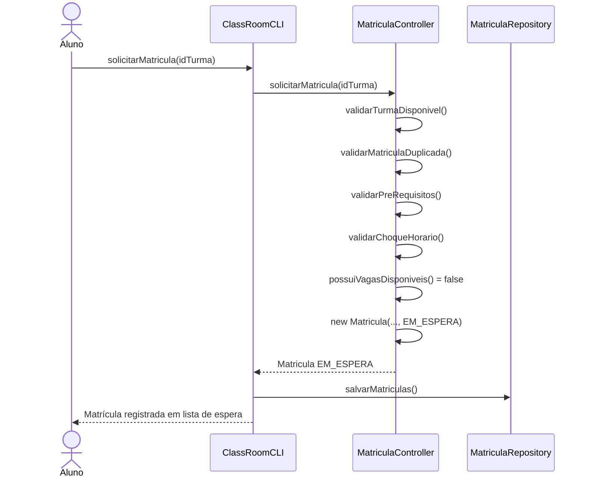

# Diagrama de Sequência — RF21

**Requisito:** Caso não haja vaga, o aluno deve entrar em lista de espera.

```mermaid
sequenceDiagram
    actor Aluno
    participant CLI as ClassRoomCLI
    participant Mat as MatriculaController
    participant Repo as MatriculaRepository

    Aluno ->> CLI: solicitarMatricula(idTurma)
    CLI ->> Mat: solicitarMatricula(idTurma)
    Mat ->> Mat: validarTurmaDisponivel()
    Mat ->> Mat: validarMatriculaDuplicada()
    Mat ->> Mat: validarPreRequisitos()
    Mat ->> Mat: validarChoqueHorario()
    Mat ->> Mat: possuiVagasDisponiveis() = false
    Mat ->> Mat: new Matricula(..., EM_ESPERA)
    Mat -->> CLI: Matricula EM_ESPERA
    CLI ->> Repo: salvarMatriculas()
    CLI -->> Aluno: Matrícula registrada em lista de espera
```
