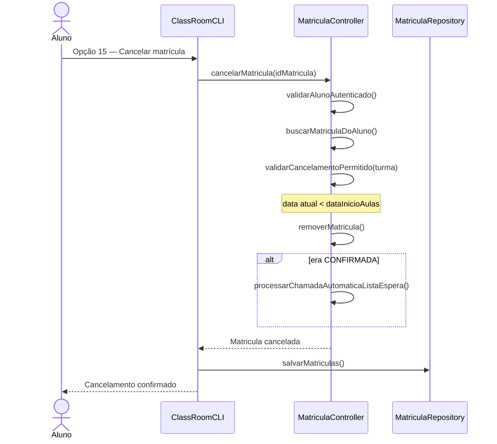
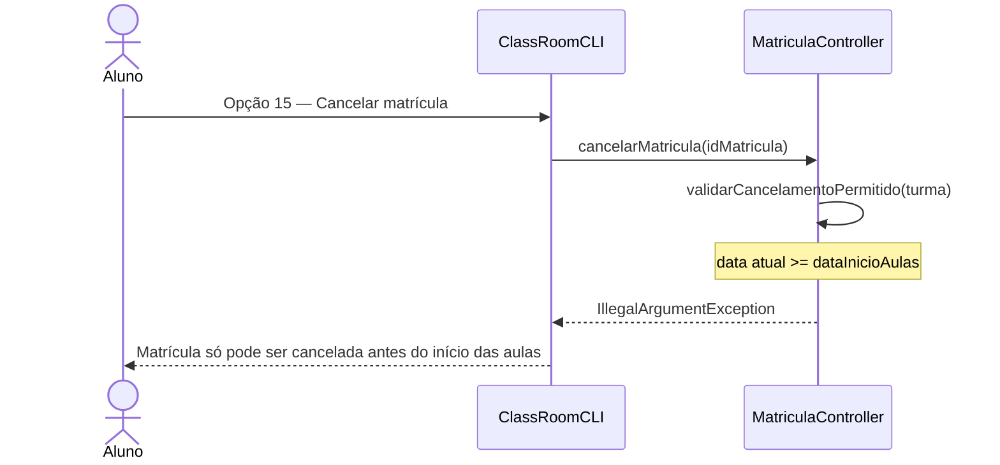

# Diagrama de Sequência — RF22

**Requisito:** O aluno deve poder cancelar matrícula dentro do período permitido.

## Cancelamento permitido (antes do início das aulas)

## Cancelamento bloqueado (após início das aulas)

