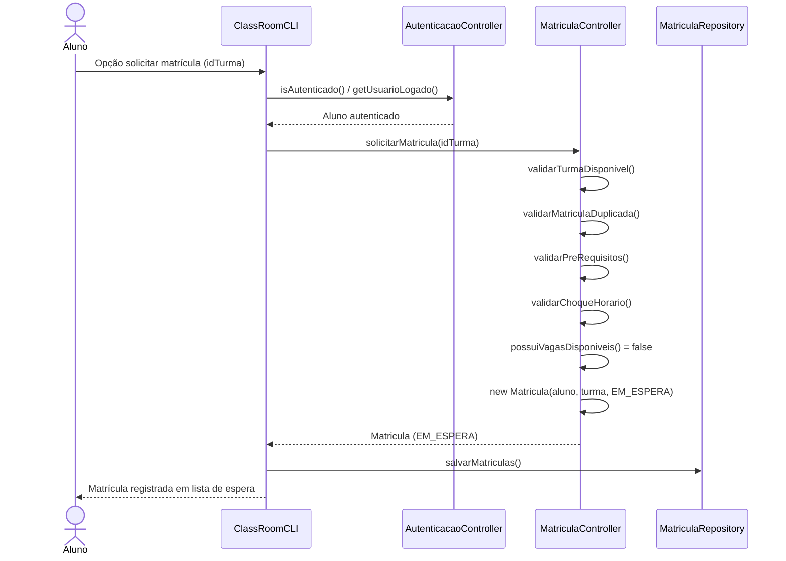
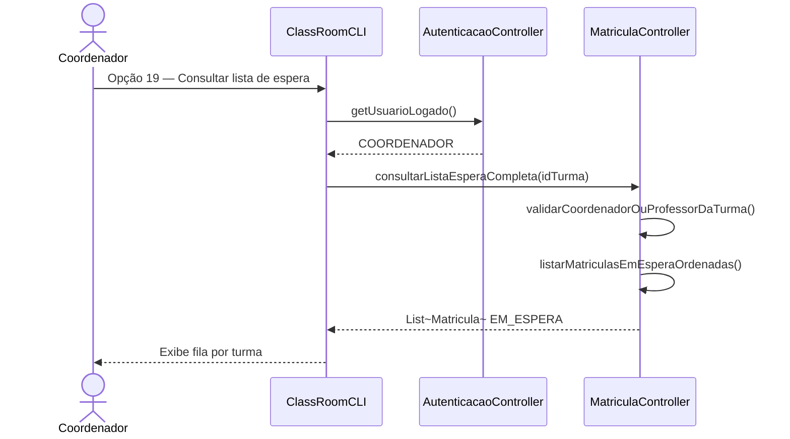
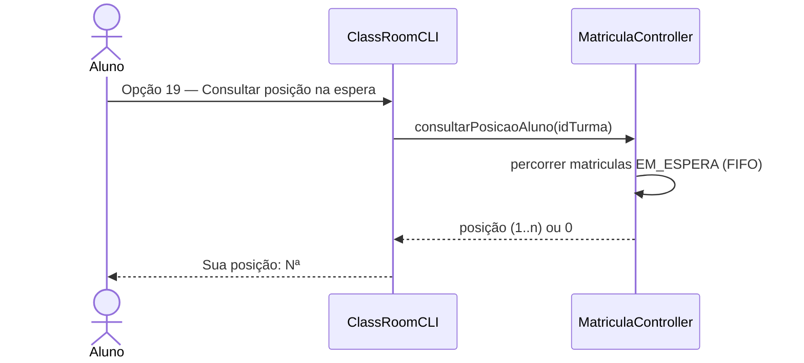
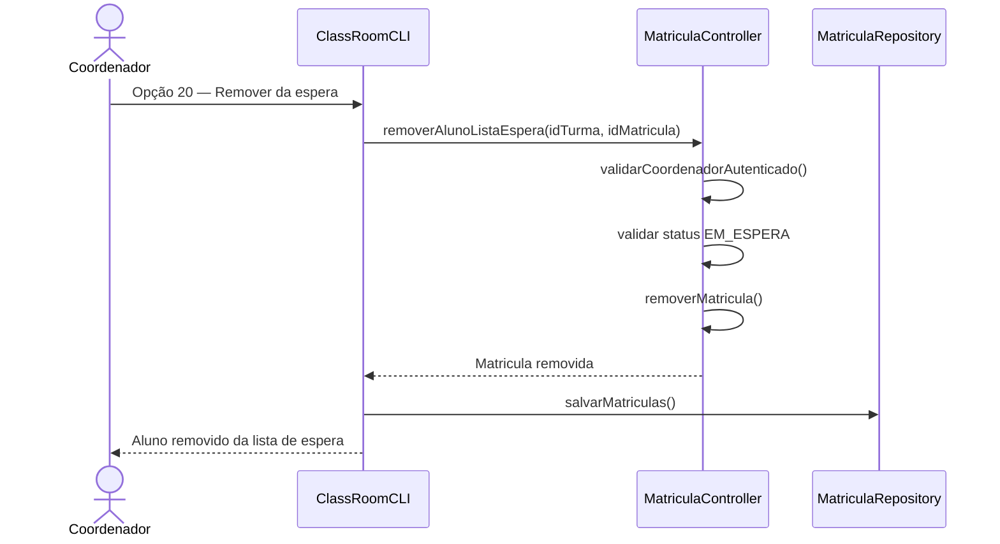

# Diagrama de Sequência — RF23

**Requisito:** O sistema deve manter lista de espera por turma.

**Fluxo principal:** aluno solicita matrícula em turma lotada → matrícula registrada com status `EM_ESPERA` → coordenador/professor consulta a fila → aluno consulta posição → coordenador remove aluno da espera.

## Solicitar matrícula sem vaga (entrada na lista de espera)

## Coordenador consulta lista de espera

## Aluno consulta posição na fila

## Coordenador remove aluno da lista de espera

