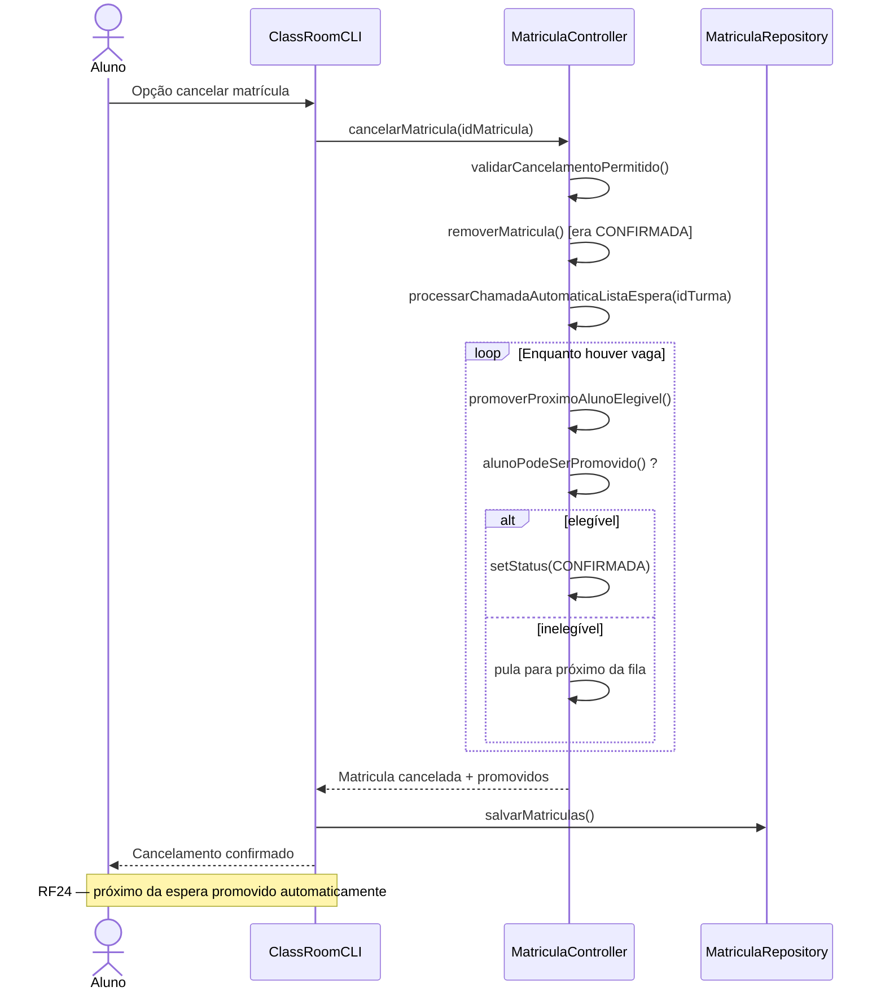
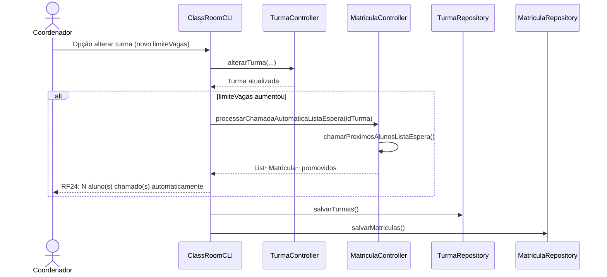
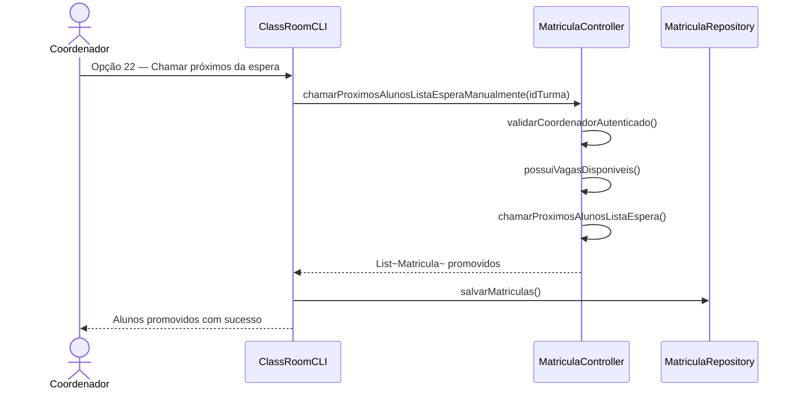

# Diagrama de Sequência — RF24

**Requisito:** Quando uma vaga for liberada, o sistema deve chamar automaticamente o próximo aluno da lista.

**Gatilhos:** cancelamento de matrícula confirmada; aumento do limite de vagas na alteração de turma; chamada manual pelo coordenador (opção 22).

## Cancelamento libera vaga e promove próximo aluno

## Aumento de vagas na alteração de turma

## Chamada manual pelo coordenador

