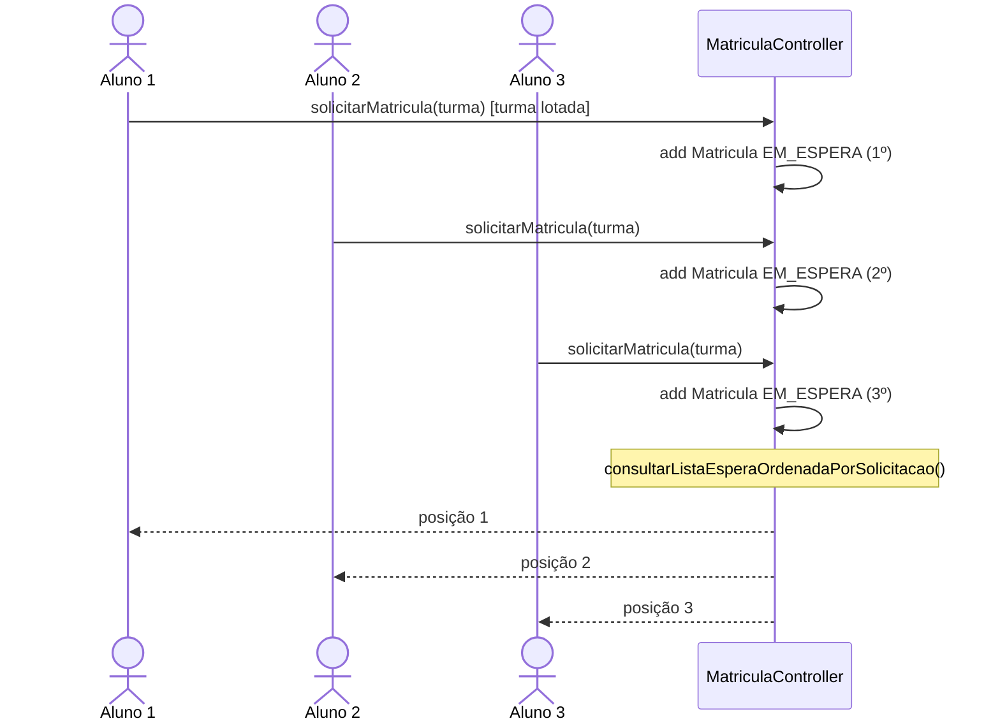
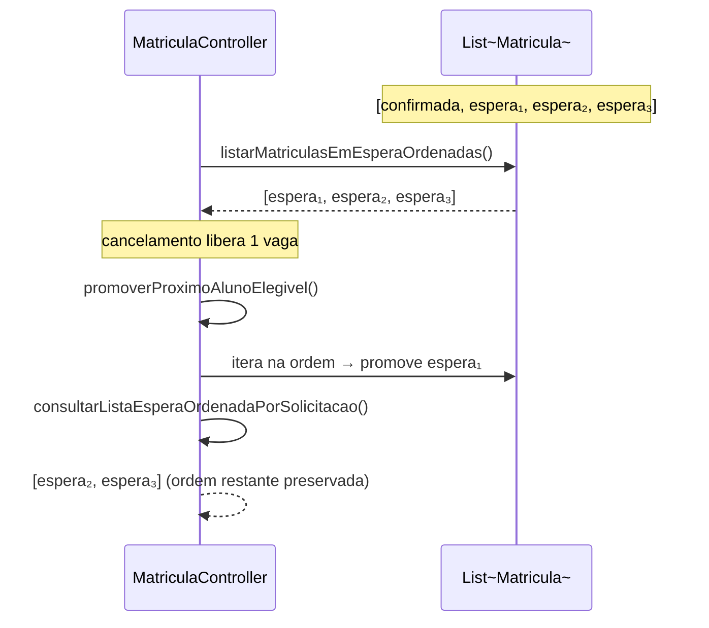
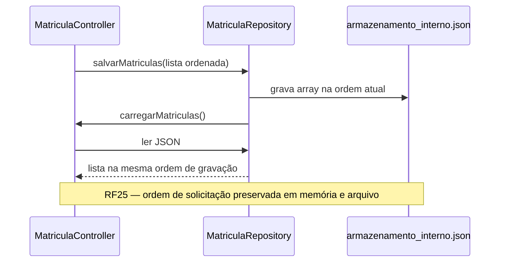

# Diagrama de Sequência — RF25

**Requisito:** A lista de espera deve respeitar a ordem de solicitação.

**Implementação:** a ordem FIFO é garantida pela sequência de inserção na lista em memória (`List<Matricula>`); consultas e promoções percorrem essa lista na mesma ordem.

## Múltiplas solicitações preservam ordem FIFO

## Consulta ordenada e promoção respeitam a fila

## Persistência mantém ordem no JSON

