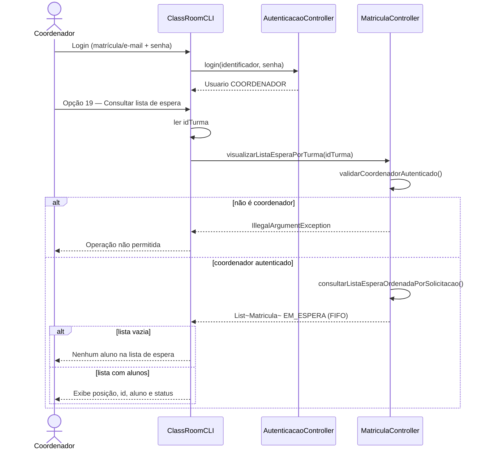
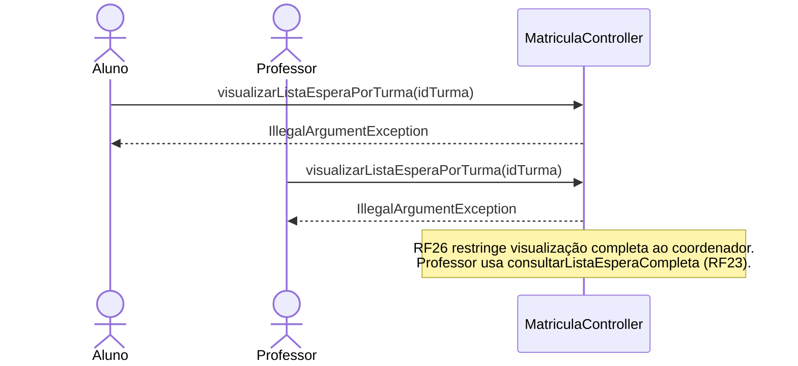

# Diagrama de Sequência — RF26

**Requisito:** O coordenador deve poder visualizar a lista de espera de cada turma.

**Método principal:** `MatriculaController.visualizarListaEsperaPorTurma(String idTurma)` — exclusivo para perfil **COORDENADOR**.

## Visualização da lista de espera por turma

## Tentativa de acesso por outros perfis (rejeitada)

