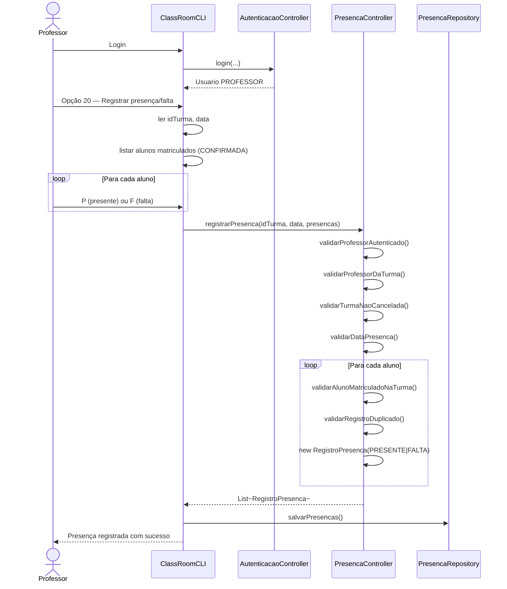
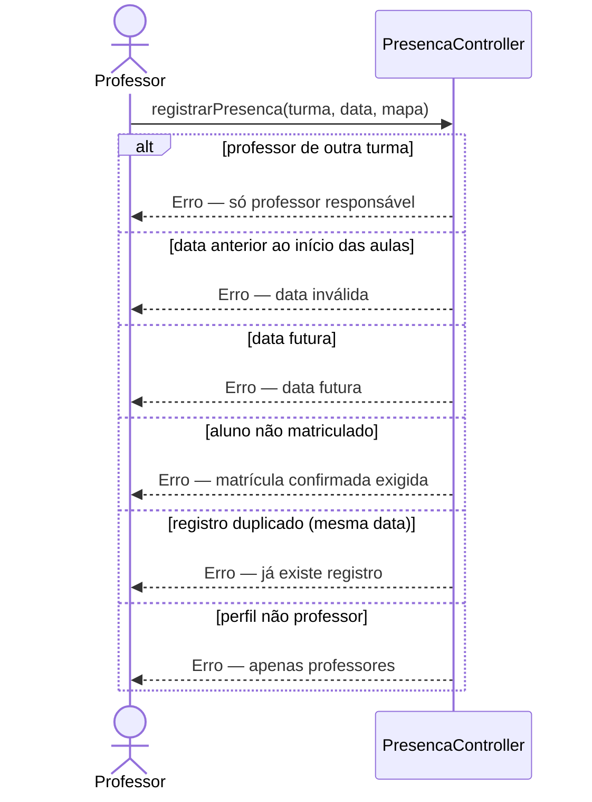

# Diagrama de Sequência — RF27

**Requisito:** O professor deve poder registrar presença/falta dos alunos por aula.

**Método principal:** `PresencaController.registrarPresenca(String idTurma, LocalDate data, Map<String, Boolean> presencas)`.

## Registrar presença/falta em uma aula

## Validações de regra de negócio

