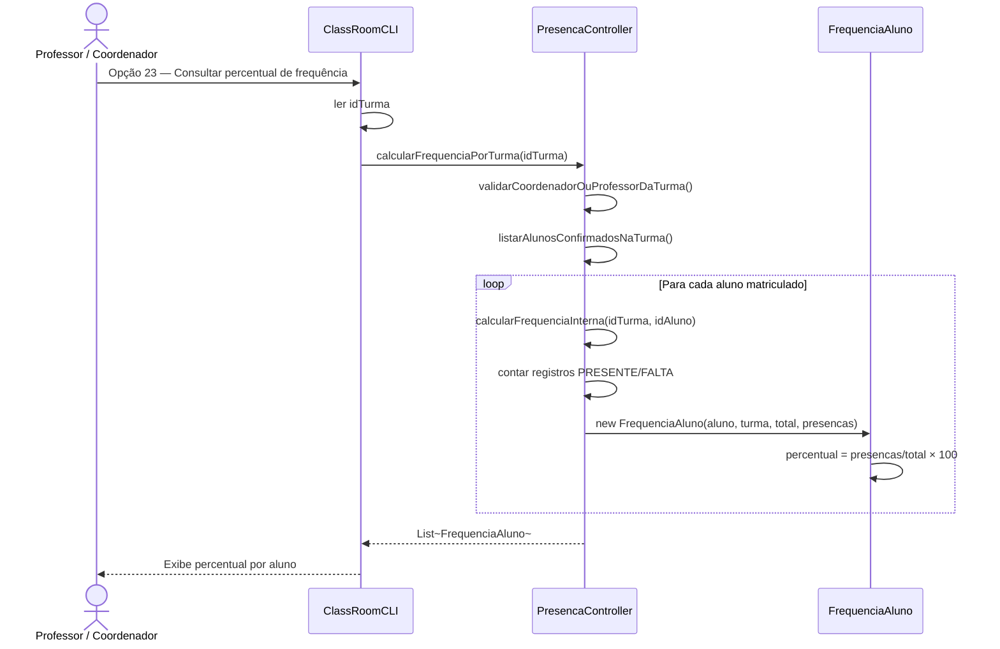
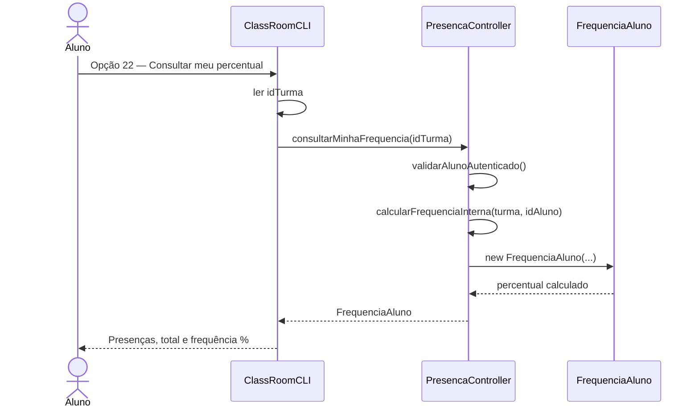
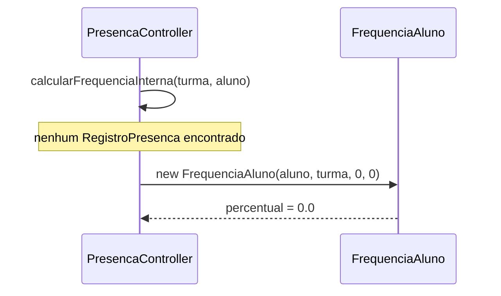

# Diagrama de Sequência — RF28

**Requisito:** O sistema deve calcular automaticamente o percentual de frequência.

**Fórmula:** `percentual = (totalPresencas / totalAulasRegistradas) × 100`, encapsulada em `FrequenciaAluno`.

## Cálculo automático por turma (professor/coordenador)

## Aluno consulta própria frequência na turma

## Sem registros → 0%

