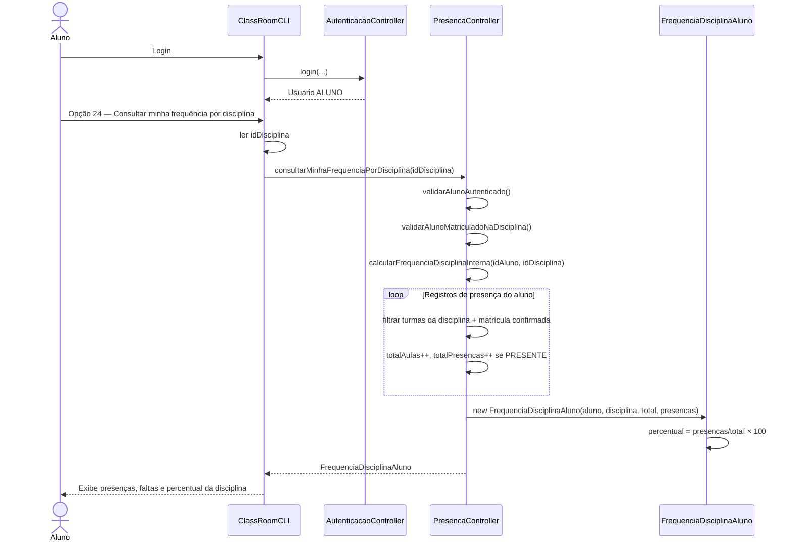
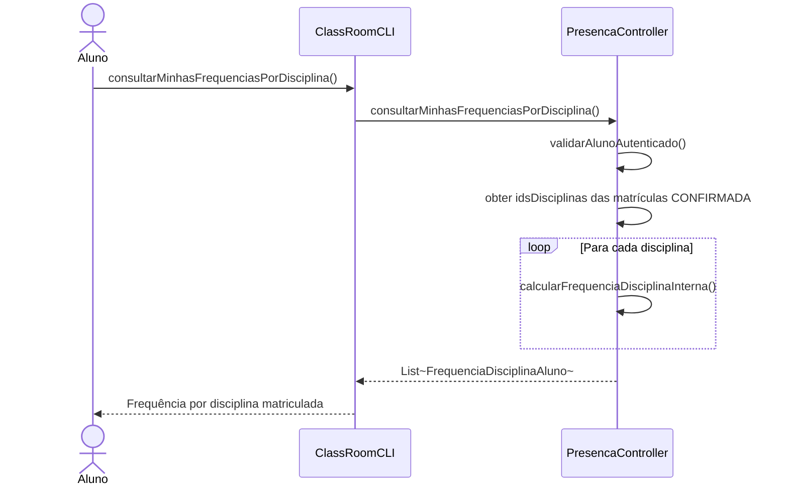
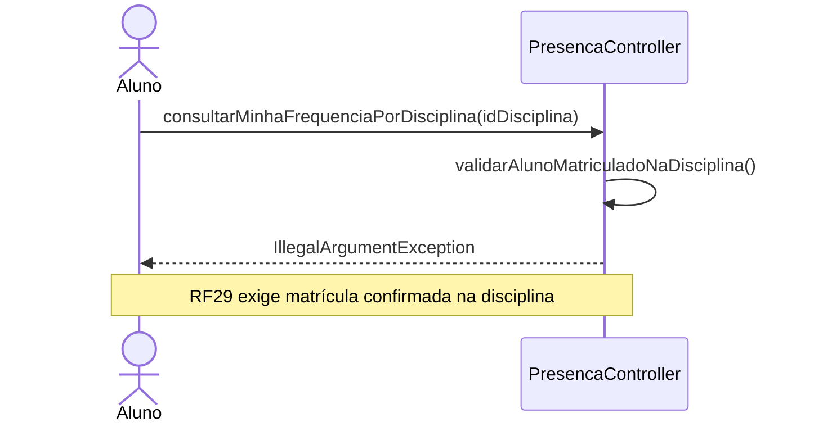

# Diagrama de Sequência — RF29

**Requisito:** O aluno deve poder consultar sua frequência por disciplina.

**Método principal:** `PresencaController.consultarMinhaFrequenciaPorDisciplina(String idDisciplina)` — agrega registros de todas as turmas confirmadas do aluno na mesma disciplina.

## Consulta de frequência agregada por disciplina

## Listar frequências em todas as disciplinas confirmadas

## Aluno sem matrícula confirmada na disciplina

