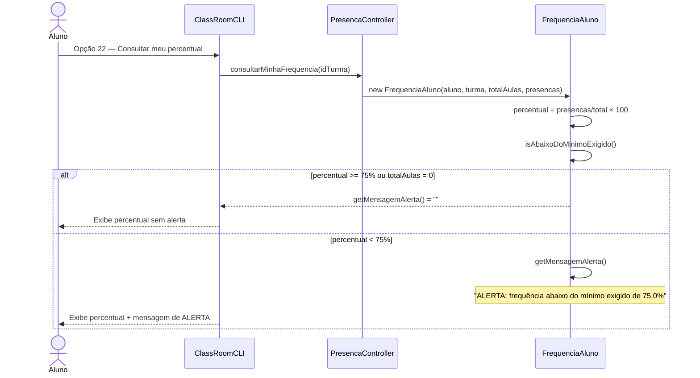
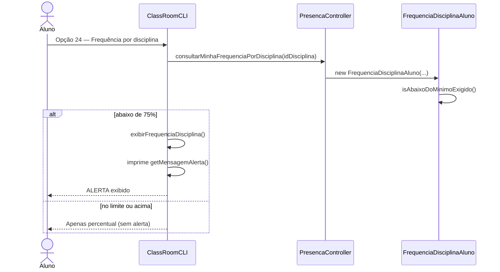
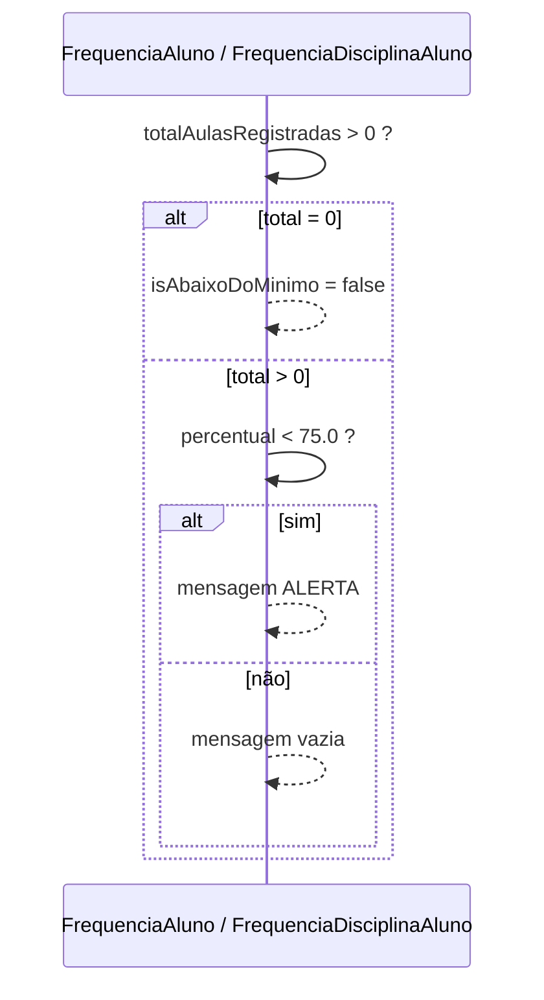

# Diagrama de Sequência — RF30

**Requisito:** O sistema deve alertar quando o aluno estiver abaixo do mínimo exigido.

**Regra:** mínimo fixo de **75%** (`PERCENTUAL_MINIMO_EXIGIDO`); alerta exibido quando há aulas registradas e `percentual < 75%`.

## Alerta na consulta de frequência por turma (RF28 + RF30)

## Alerta na consulta por disciplina (RF29 + RF30)

## Decisão do alerta (modelo)

