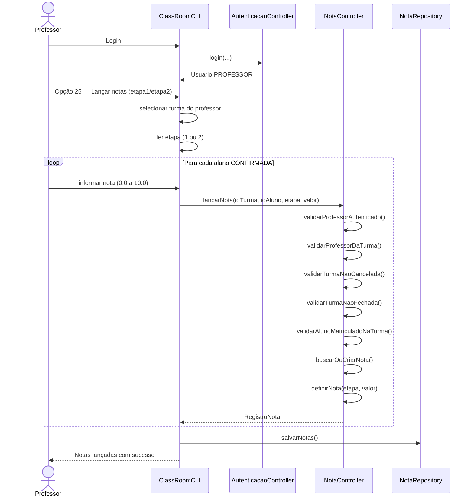
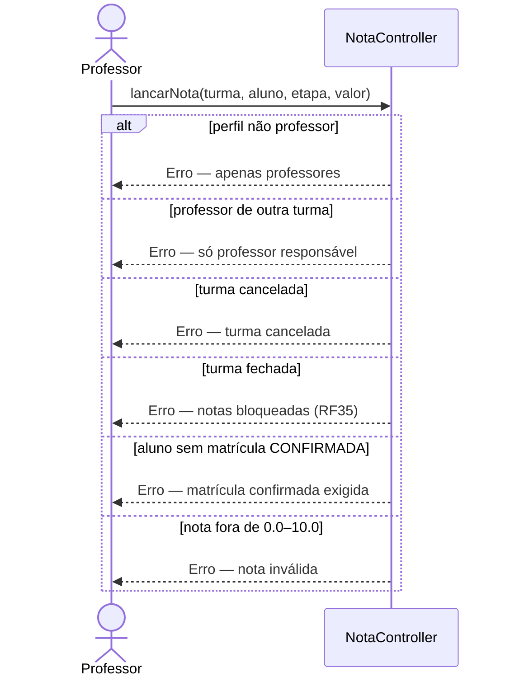

# Diagrama de Sequência — RF31

**Requisito:** O professor deve poder lançar notas das etapas (etapa1 e etapa2).

**Método principal:** `NotaController.lancarNota(String idTurma, String idAluno, EtapaAvaliacao etapa, double valor)`.

## Lançar notas das etapas

## Validações de regra de negócio

