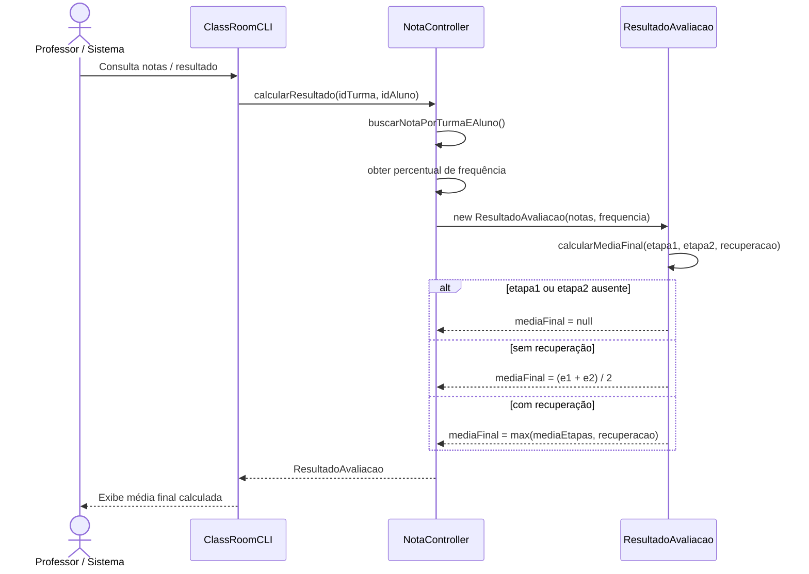
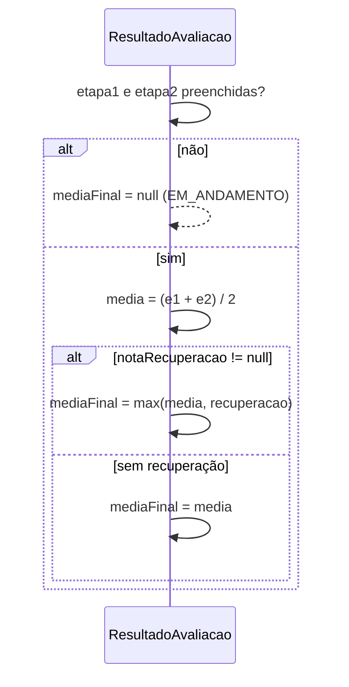

# Diagrama de Sequência — RF32

**Requisito:** O sistema deve calcular automaticamente a média final.

**Fórmula:** `mediaEtapas = (etapa1 + etapa2) / 2`; com recuperação: `mediaFinal = max(mediaEtapas, notaRecuperacao)`.

**Método principal:** `ResultadoAvaliacao.calcularMediaFinal(...)` via `NotaController.calcularResultado`.

## Cálculo automático da média final

## Decisão da média (modelo)

