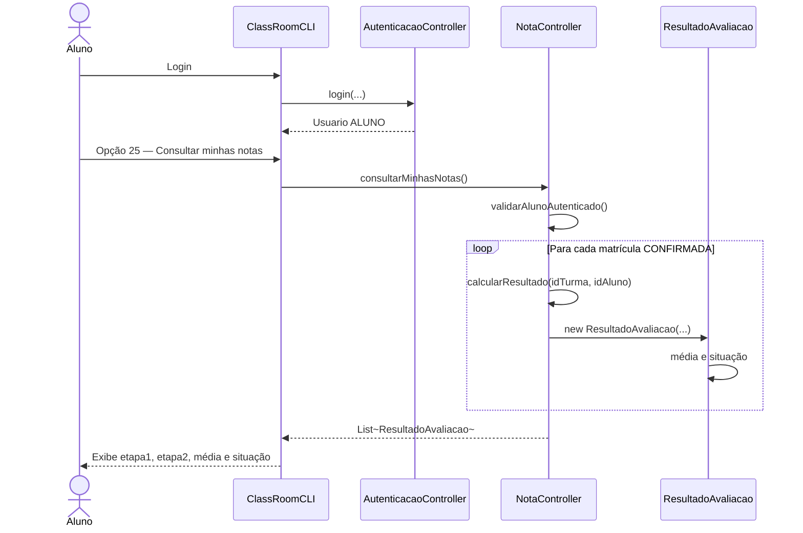
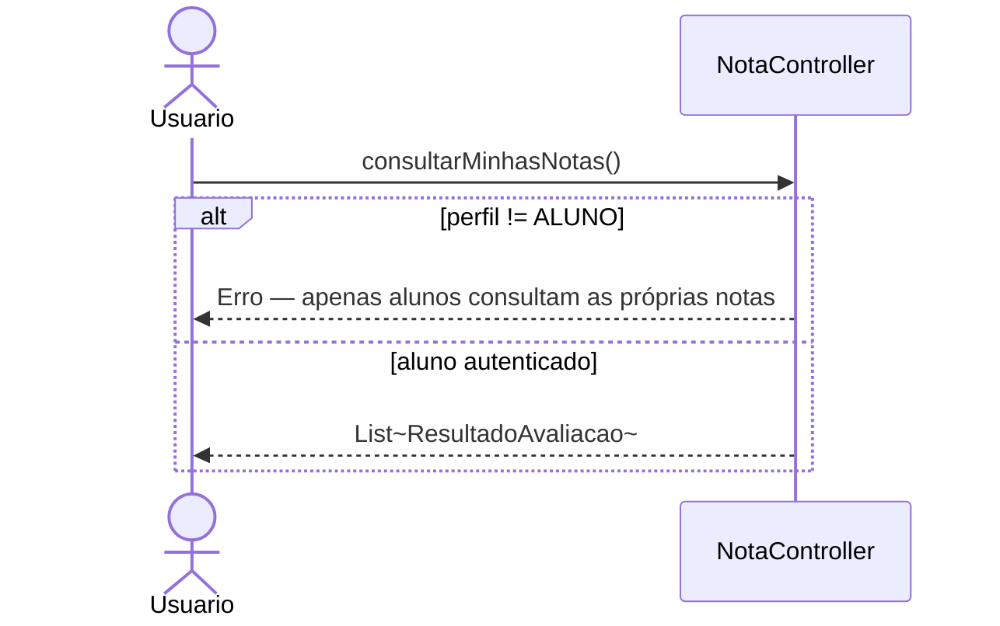

# Diagrama de Sequência — RF33

**Requisito:** O aluno deve poder consultar suas notas.

**Método principal:** `NotaController.consultarMinhasNotas()`.

## Aluno consulta próprias notas

## Restrição de perfil

