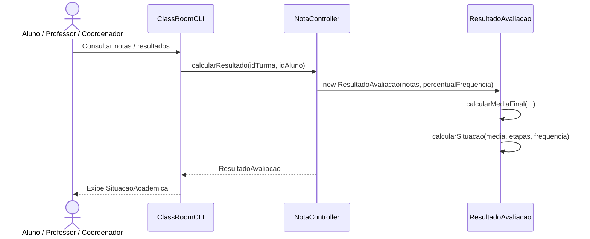
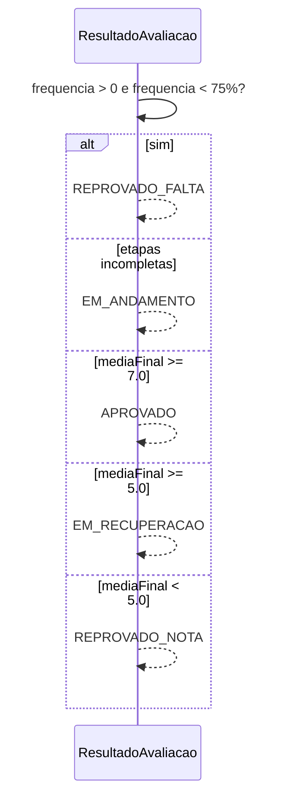
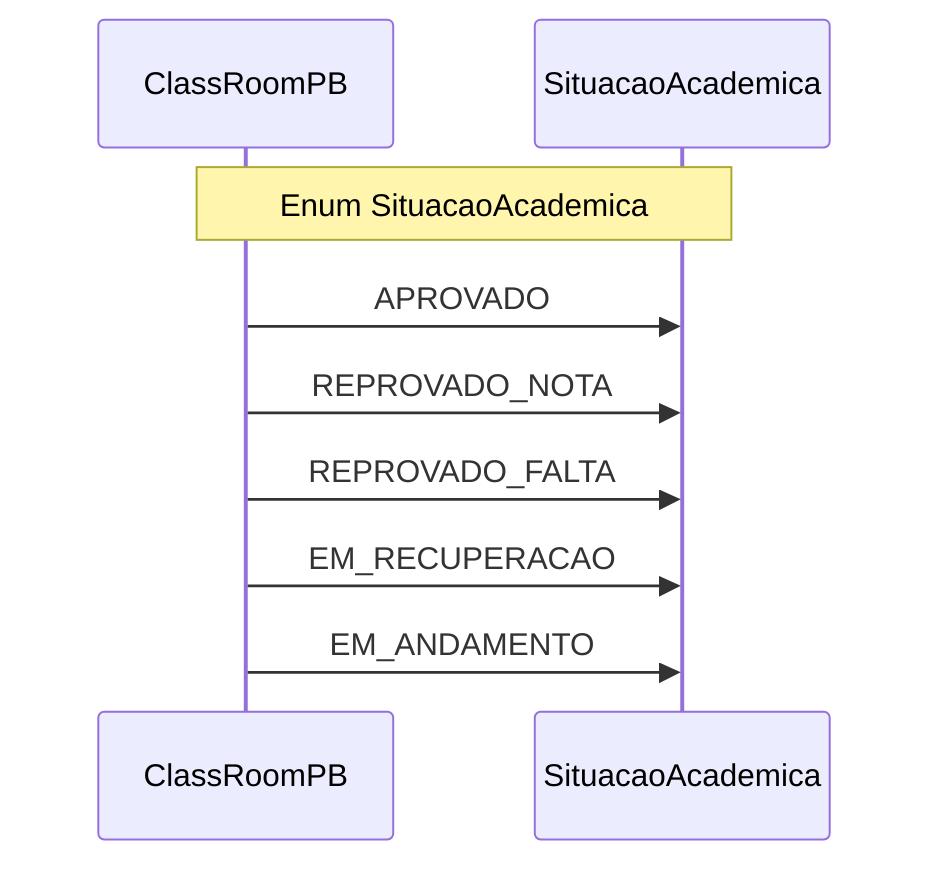

# Diagrama de Sequência — RF34

**Requisito:** O sistema deve informar a situação do aluno: aprovado, reprovado por nota, reprovado por falta ou em recuperação.

**Regras:** frequência &lt; 75% → `REPROVADO_FALTA`; média ≥ 7 → `APROVADO`; 5 ≤ média &lt; 7 → `EM_RECUPERACAO`; média &lt; 5 → `REPROVADO_NOTA`; etapas incompletas → `EM_ANDAMENTO`.

## Cálculo da situação acadêmica

## Decisão da situação

## Situações possíveis

