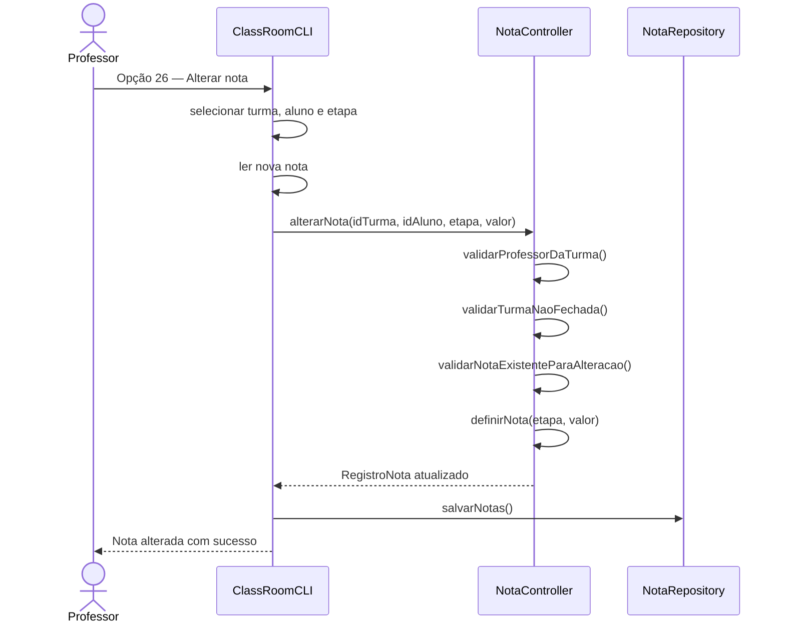
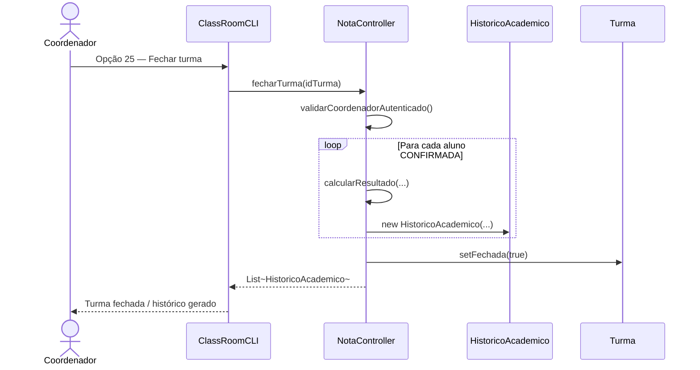
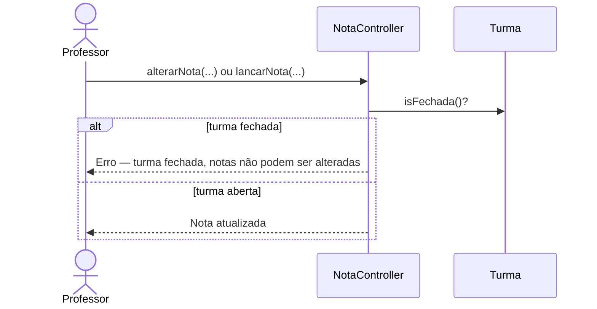

# Diagrama de Sequência — RF35

**Requisito:** O professor deve poder alterar notas antes do fechamento da turma.

**Métodos:** `NotaController.alterarNota(...)` e `NotaController.fecharTurma(...)` (coordenador).

## Alterar nota antes do fechamento

## Fechar turma e bloquear alterações

## Bloqueio após fechamento

