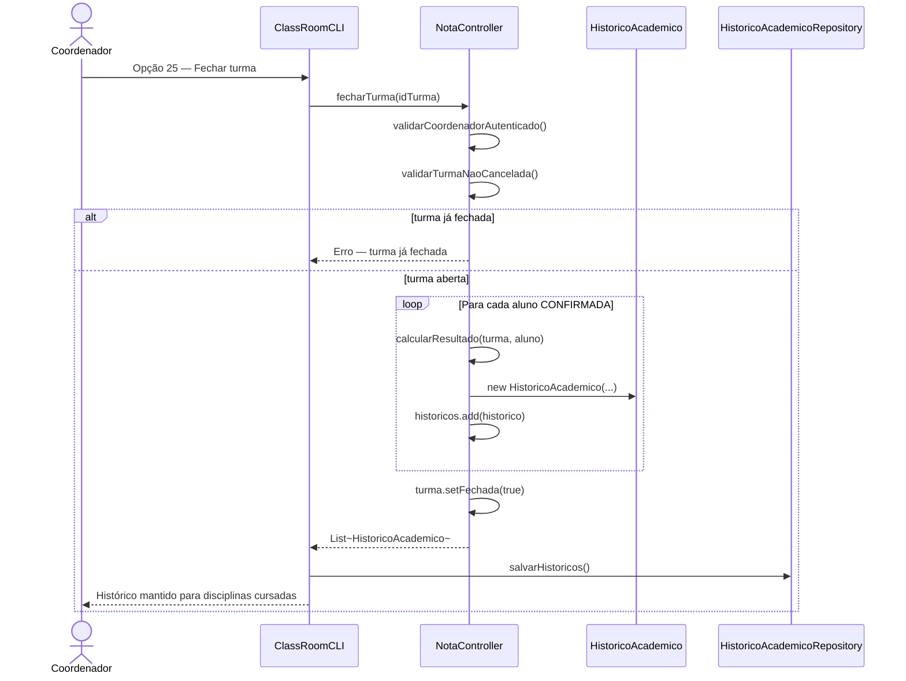
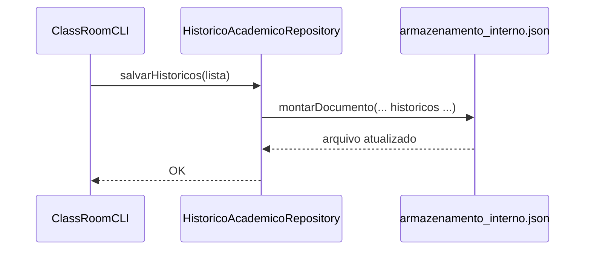

# Diagrama de Sequência — RF36

**Requisito:** O sistema deve manter histórico das disciplinas cursadas pelo aluno.

**Método principal:** `NotaController.fecharTurma(String idTurma)` gera e persiste `HistoricoAcademico`.

## Geração do histórico no fechamento da turma

## Persistência do histórico

