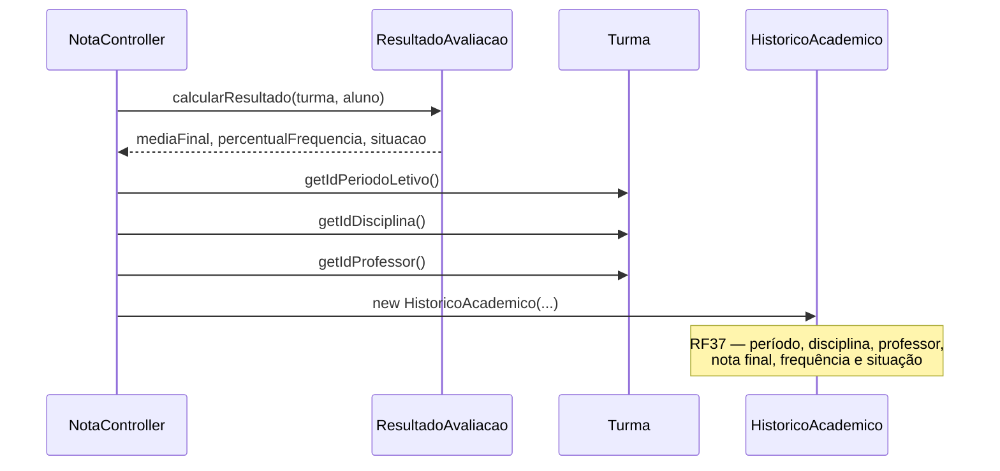
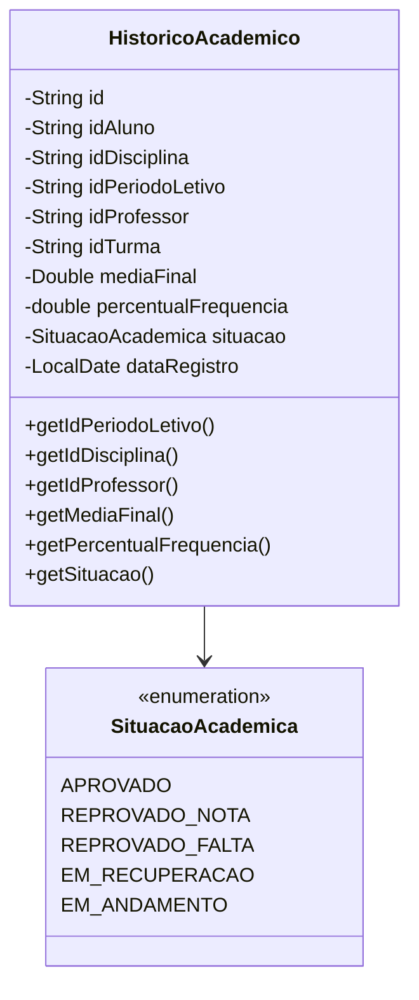

# Diagrama de Sequência — RF37

**Requisito:** O histórico deve registrar período, disciplina, professor, nota final, frequência e situação.

**Modelo:** `HistoricoAcademico` com campos obrigatórios do RF37.

## Campos registrados no histórico

## Estrutura do registro

