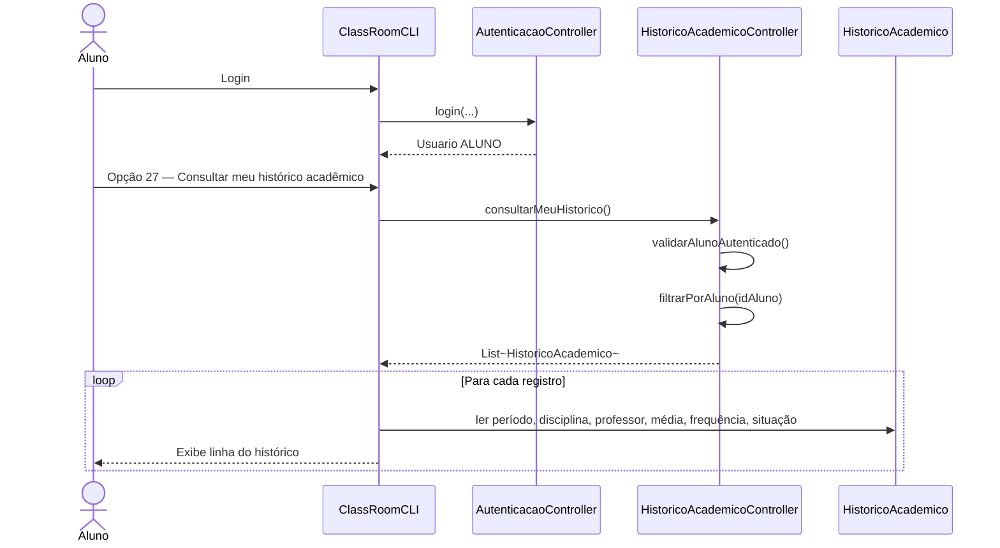
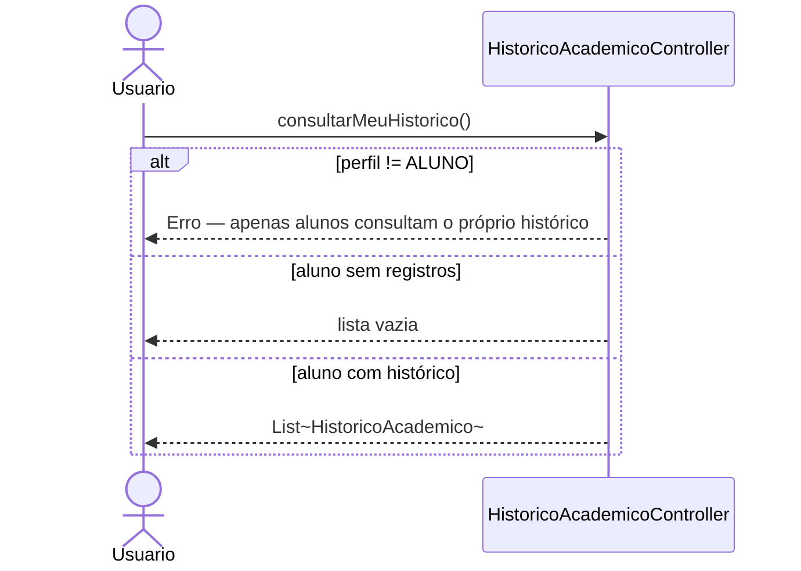

# Diagrama de Sequência — RF38

**Requisito:** O aluno deve poder consultar seu histórico acadêmico.

**Método principal:** `HistoricoAcademicoController.consultarMeuHistorico()`.

## Aluno consulta próprio histórico

## Restrição de acesso

