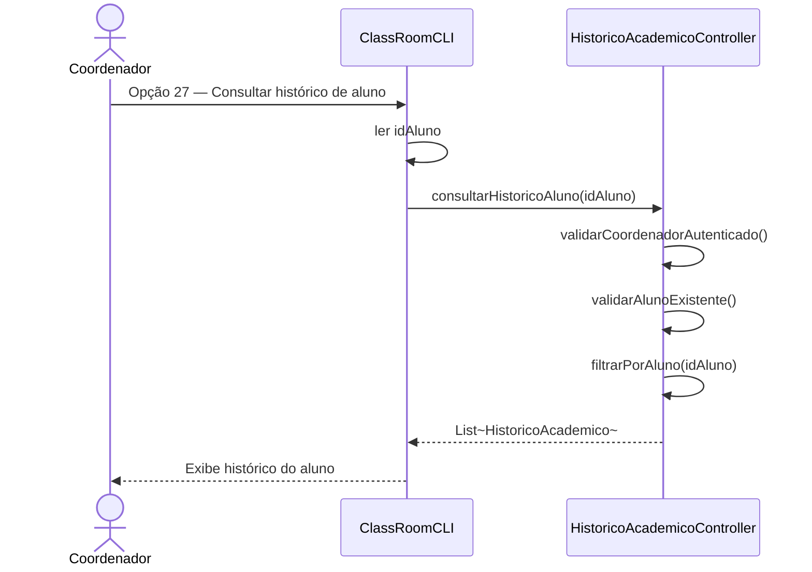
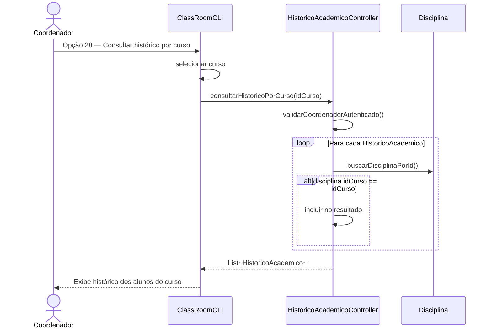
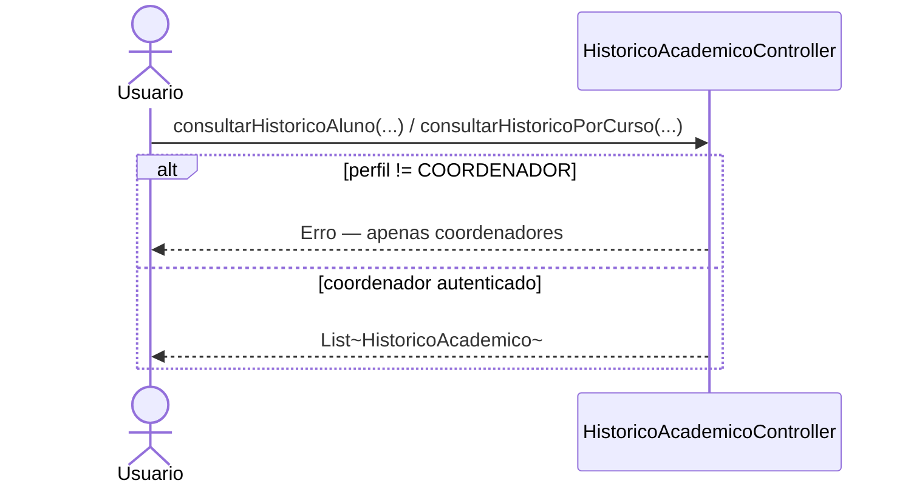

# Diagrama de Sequência — RF39

**Requisito:** O coordenador deve poder consultar o histórico dos alunos do curso.

**Métodos:** `consultarHistoricoAluno(String idAluno)` e `consultarHistoricoPorCurso(String idCurso)`.

## Coordenador consulta histórico de um aluno

## Coordenador consulta histórico por curso

## Restrição de perfil

