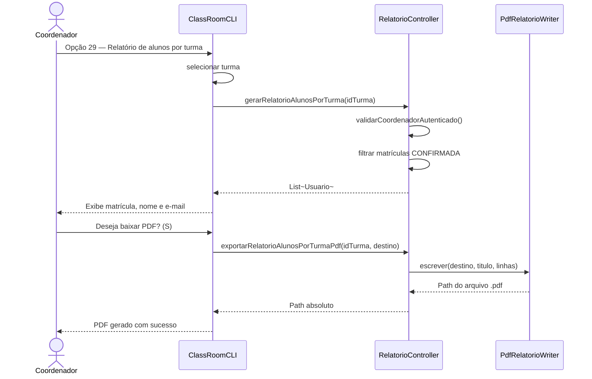
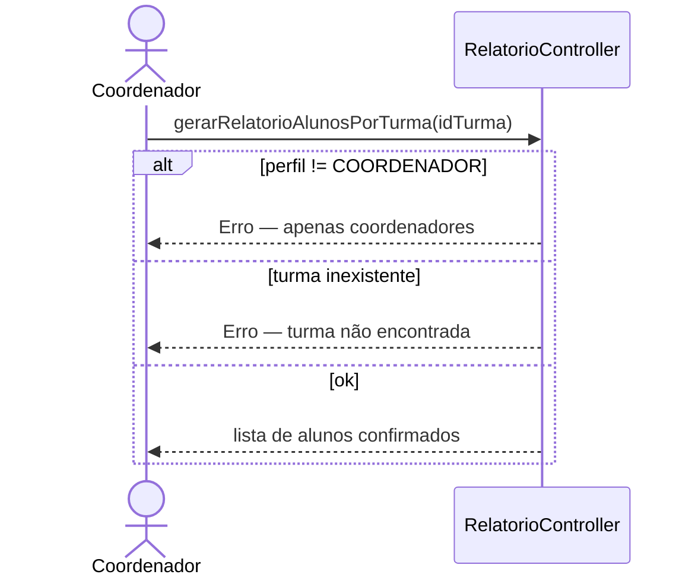

# Diagrama de Sequência — RF40

**Requisito:** O coordenador deve gerar relatório de alunos matriculados por turma.

**Métodos:** `RelatorioController.gerarRelatorioAlunosPorTurma` e `exportarRelatorioAlunosPorTurmaPdf`.

## Gerar relatório e baixar PDF

## Validações

