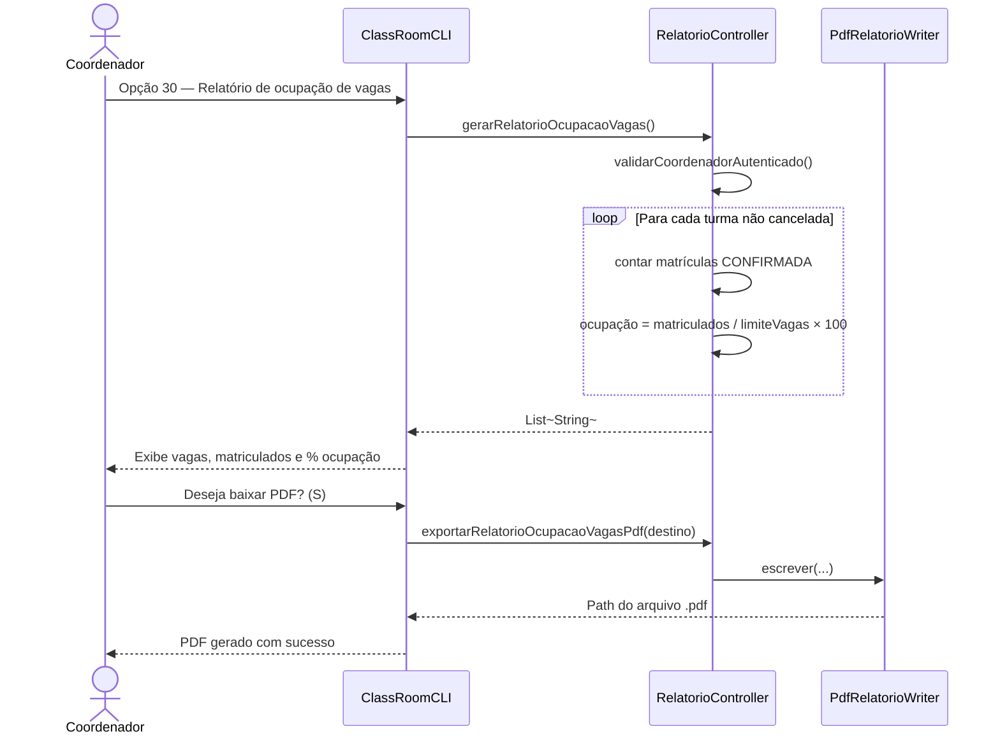
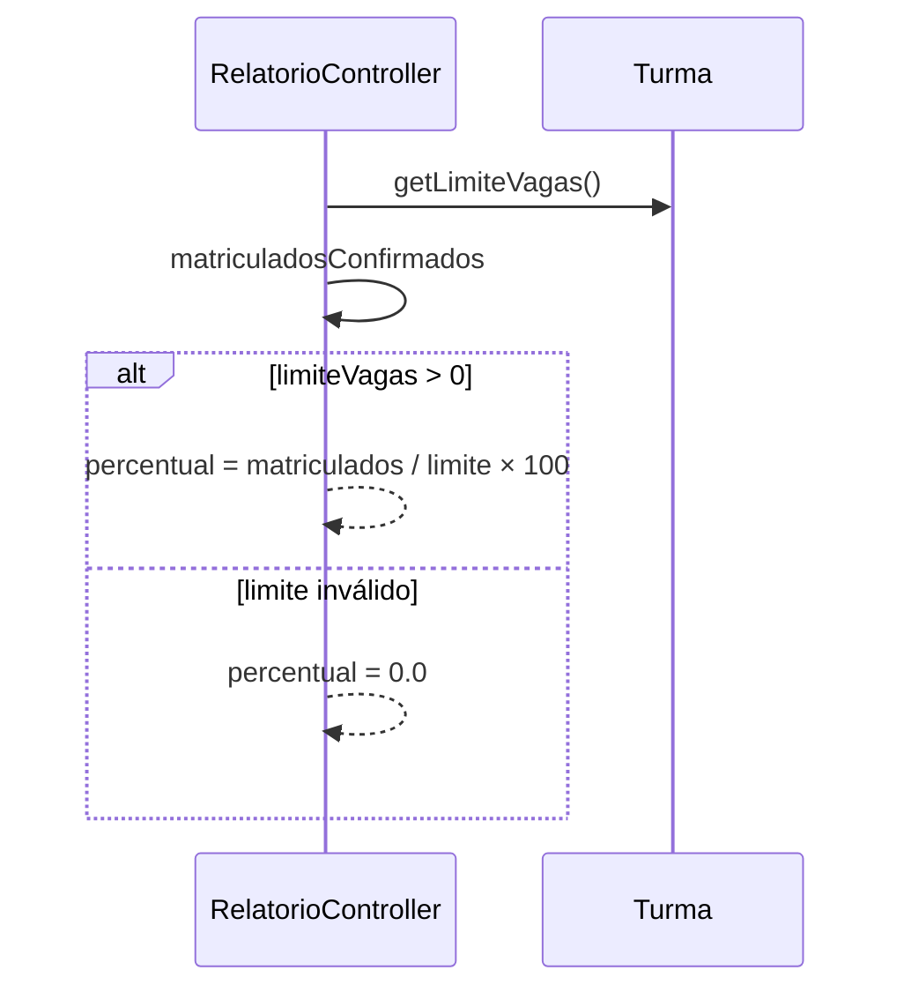

# Diagrama de Sequência — RF41

**Requisito:** O coordenador deve gerar relatório de ocupação de vagas.

**Métodos:** `RelatorioController.gerarRelatorioOcupacaoVagas` e `exportarRelatorioOcupacaoVagasPdf`.

## Gerar relatório de ocupação e baixar PDF

## Cálculo de ocupação

