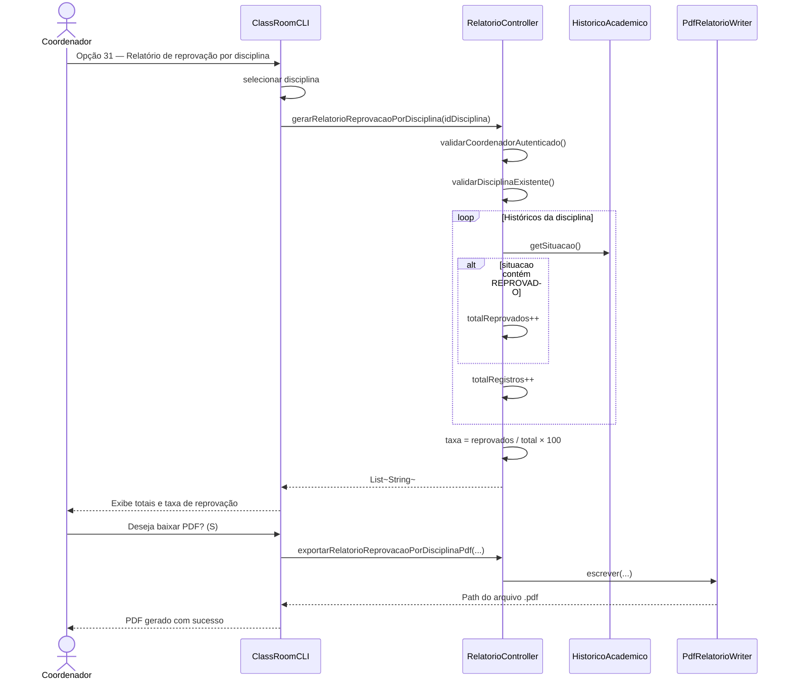
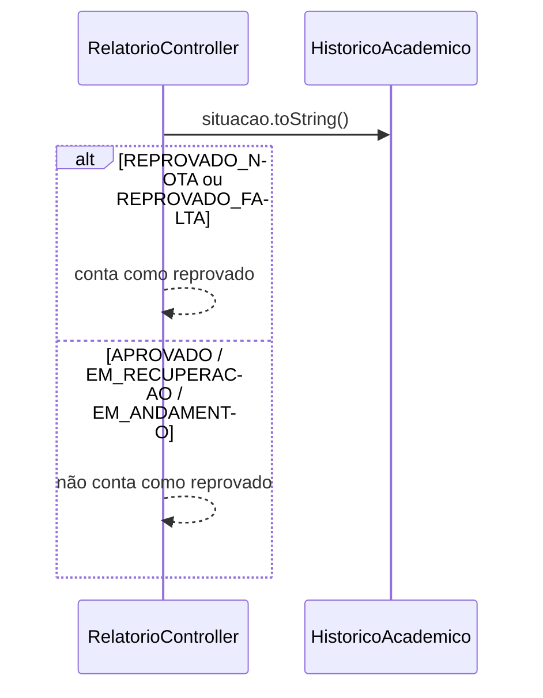

# Diagrama de Sequência — RF42

**Requisito:** O coordenador deve gerar relatório de reprovação por disciplina.

**Métodos:** `RelatorioController.gerarRelatorioReprovacaoPorDisciplina` e `exportarRelatorioReprovacaoPorDisciplinaPdf`.

## Gerar relatório de reprovação e baixar PDF

## Contagem de reprovações

