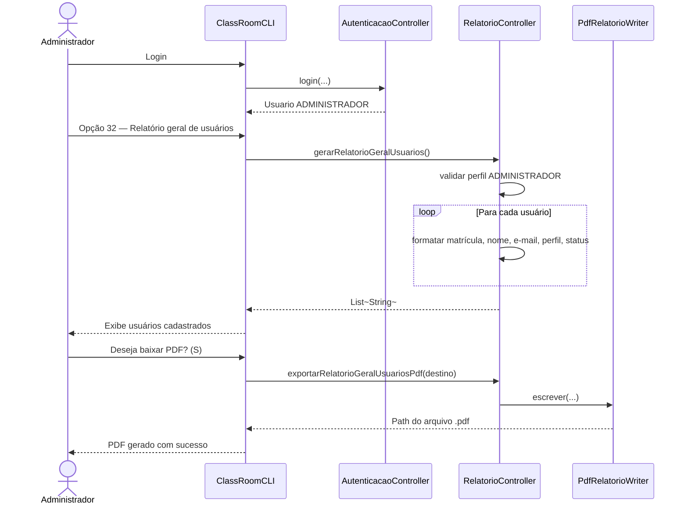
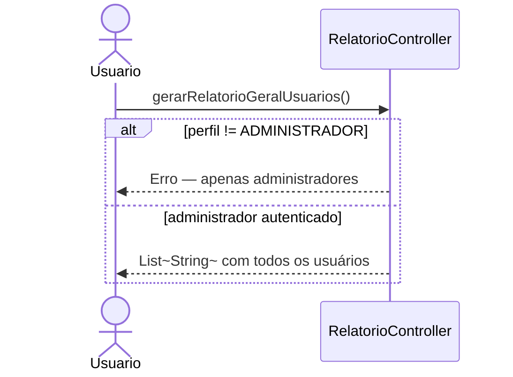

# Diagrama de Sequência — RF43

**Requisito:** O administrador deve gerar relatório geral de usuários cadastrados.

**Métodos:** `RelatorioController.gerarRelatorioGeralUsuarios` e `exportarRelatorioGeralUsuariosPdf`.

## Gerar relatório de usuários e baixar PDF

## Restrição de perfil

